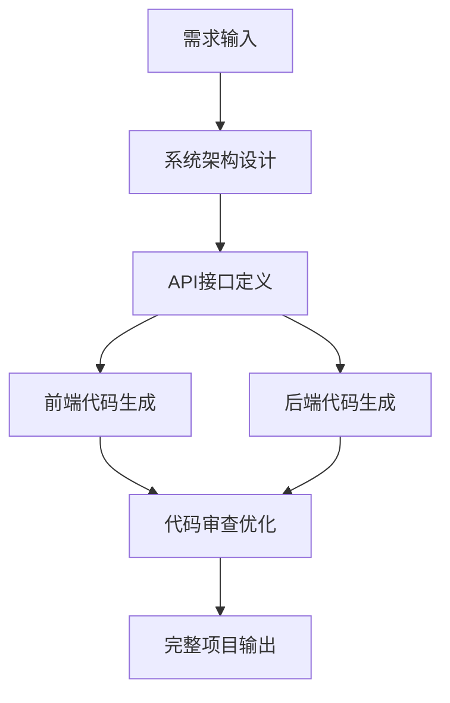

# 🚀 拯救混乱的代码生成：打造可控、风格统一的多层工作流系统

现代软件开发中，AI代码生成已经从尝鲜走向生产。但很多开发者发现，直接使用大模型生成代码，反而带来了一系列新的问题：

- ❌ 生成代码风格不一致，难以融入项目
- ❌ 上下文理解不到位，模型“不知道”你要什么
- ❌ 生成内容太多、结构太杂，容易 token 爆炸、逻辑混乱

这篇文章将带你走进一个迷你但实用的【代码生成工作流系统】，通过分层、分步骤地引导大模型输出结构清晰、风格统一、可直接落地的代码，让你的 AI 编程体验从“猜谜游戏”变成“自动搭建工厂”。

---

## 1 为什么需要工作流来驱动代码生成？

### 1.1 “傻大黑粗”的一次性生成，问题在哪？

当前很多代码生成过程是“一次喊话”，比如输入一句“写一个文章管理系统”，结果模型：

- 🔀 随机写出各种风格不一致的代码；
- 🧱 忽略了你项目已有的框架结构；
- 💣 输出几十页代码，不分前后端、难以修改维护。

生成结果和项目代码风格完全脱节，只能当“参考”。

### 1.2 精细控制的多步骤生成，是破局关键

本项目引入了以下关键设计：

- **上下文加载器**：预加载已有代码、框架、配置，提供“环境感知”
- **分步骤执行**：从架构到前后端再到配置文件，逐步生成
- **多模型支持**：不同模型分工合作，提升效果与控制力

效果如下图（工作流执行日志节选）：
本次生成全部调用的是本地ollama的模型qwen3:14b(当精确控制token不是线上大模型也会变得同样优秀)
代码目录：
generated_code
生成流程日记目录：
logs

## 2. 解决方案：构建智能代码生成工作流

### 2.1 整体架构设计

我们的解决方案采用**分层工作流**的设计思路：



### 2.2 核心组件介绍

#### 2.2.1 多LLM支持体系
```python
class LLMProvider(Enum):
    OPENAI = "openai"      # GPT-4：逻辑复杂的架构设计
    DEEPSEEK = "deepseek"  # DeepSeek：性价比高的代码生成
    OLLAMA = "ollama"      # 本地模型：隐私安全的选择
```

不同的任务使用最适合的模型：
- **架构设计**：使用DeepSeek的强大推理能力
- **API定义**：使用GPT-4的精确逻辑
- **代码生成**：使用CodeLlama的专业编程能力

#### 2.2.2 智能上下文管理
```python
@dataclass
class ContextConfig:
    framework: str           # 技术框架
    requirements: str        # 开发要求
    example_files: List[str] # 示例代码文件
    documentation_files: List[str] # 文档文件
```

系统会自动加载项目相关的：
- 📁 **示例代码**：让AI学习你的编码风格
- 📚 **技术文档**：确保生成的代码符合框架规范
- ⚙️ **配置文件**：保持项目配置的一致性

### 2.3 工作流执行引擎

#### 2.3.1 步骤依赖管理
```python
steps:
  - name: "architecture_design"
    depends_on: []  # 第一步，无依赖
    
  - name: "api_definition"  
    depends_on: ["architecture_design"]  # 依赖架构设计
    
  - name: "frontend_generation"
    depends_on: ["api_definition"]  # 依赖API定义
```

#### 2.3.2 智能输出清理
```python
class OutputCleaner:
    @staticmethod
    def clean_output(output: str) -> str:
        # 移除AI的内部思考过程
        output = re.sub(r'<think>.*?</think>', '', output, flags=re.DOTALL)
        return output.strip()
```

确保传递给下一步的是纯净的业务代码，而不是AI的"自言自语"。

## 3. 实战演示：从零到全栈应用

### 3.1 环境准备

#### 3.1.1 安装依赖
```bash
pip install langchain-openai langchain-ollama langchain-core
pip install pyyaml asyncio
```

#### 3.1.2 配置LLM
创建 `llm_config.yaml`：
```yaml
llm_configs:
  - name: "deepseek_chat"
    provider: "deepseek"
    model: "deepseek-chat"
    temperature: 0.3
    api_key: "your_api_key"
```

### 3.2 定义工作流

#### 3.2.1 上下文配置
```yaml
contexts:
  frontend:
    framework: "Vue 3 + iView UI"
    requirements: |
      - 使用Vue 3 Composition API
      - 使用iView UI组件库
      - 支持响应式设计
```

#### 3.2.2 步骤配置
```yaml
steps:
  - name: "architecture_design"
    llm_name: "deepseek_chat"
    prompt_template: |
      你是一个资深的系统架构师，请根据以下需求设计系统架构：
      需求描述：{requirement}
      
      请提供：
      1. 系统整体架构设计
      2. 数据库表结构设计（包含DDL语句）
      3. 核心业务流程说明
```

### 3.3 执行效果展示

#### 3.3.1 启动工作流
```bash
python main.py
```


#### 3.3.2 生成结果预览

**架构设计输出**：
```
系统整体架构设计：
├── 前端层 (Vue 3 + iView UI)
├── API网关层 (Spring Boot)
├── 业务逻辑层 (Service)
├── 数据访问层 (MyBatis)
└── 数据存储层 (MySQL)

数据库设计：
CREATE TABLE `user` (
  `id` bigint NOT NULL AUTO_INCREMENT,
  `username` varchar(50) NOT NULL,
  `email` varchar(100) NOT NULL,
  PRIMARY KEY (`id`)
) ENGINE=InnoDB DEFAULT CHARSET=utf8mb4;
```

**API接口定义**：
```json
{
  "path": "/api/users",
  "method": "GET",
  "description": "获取用户列表",
  "response": {
    "code": 200,
    "data": [],
    "message": "success"
  }
}
```

### 3.4 生成的完整代码结构

#### 3.4.1 前端代码
```vue
<template>
  <div class="user-management">
    <Table :columns="columns" :data="userList" />
  </div>
</template>

<script setup>
import { ref, onMounted } from 'vue'
import { getUserList } from '@/api/user'

const userList = ref([])
const columns = ref([
  { title: 'ID', key: 'id' },
  { title: '用户名', key: 'username' }
])

onMounted(async () => {
  const { data } = await getUserList()
  userList.value = data
})
</script>
```

#### 3.4.2 后端代码
```java
@RestController
@RequestMapping("/api/users")
public class UserController {
    
    @Autowired
    private UserService userService;
    
    @GetMapping
    public Result<List<User>> getUserList() {
        List<User> users = userService.getUserList();
        return Result.success(users);
    }
}
```

## 4. 高级特性：让工作流更智能

### 4.1 动态提示词优化

#### 4.1.1 上下文感知提示
```python
def _build_prompt(self, step_config: StepConfig, input_data: Dict[str, Any]) -> str:
    # 根据上下文动态调整提示词
    if step_config.context_type:
        context = self.context_manager.get_context(step_config.context_type)
        input_data["context"] = context
    
    prompt_template = ChatPromptTemplate.from_template(step_config.prompt_template)
    return prompt_template.format(**input_data)
```

#### 4.1.2 智能错误恢复
```python
try:
    result = await self._execute_step(step_config)
except Exception as e:
    # 记录错误并继续执行
    error_result = StepResult(
        step_name=step_config.name,
        success=False,
        error_message=str(e)
    )
    self.logger.log_step_result(error_result)
```

### 4.2 质量保证机制

#### 4.2.1 多轮代码审查
```yaml
- name: "code_review"
  llm_name: "gpt4_reviewer"
  prompt_template: |
    对生成的代码进行review：
    
    前端代码：{frontend_generation}
    后端代码：{backend_generation}
    
    请从以下维度审查：
    1. 代码质量和规范性
    2. 性能优化建议
    3. 安全性检查
```

#### 4.2.2 输出格式规范化
```python
class OutputCleaner:
    @staticmethod
    def clean_output(output: str) -> str:
        # 移除AI内部思考标签
        output = re.sub(r'<think>.*?</think>', '', output, flags=re.DOTALL)
        # 清理多余空白
        output = re.sub(r'\n\s*\n\s*\n', '\n\n', output)
        return output.strip()
```

### 4.3 扩展性设计

#### 4.3.1 插件化LLM支持
```python
class LLMFactory:
    @staticmethod
    def create_llm(config: LLMConfig):
        if config.provider == "custom":
            # 支持自定义LLM提供商
            return CustomLLM(config)
        # ... 其他提供商
```

#### 4.3.2 模板化工作流
```yaml
# 可以创建不同场景的工作流模板
template: "microservice"  # 微服务架构模板
template: "monolith"      # 单体应用模板
template: "mobile-app"    # 移动应用模板
```

## 5. 性能优化与最佳实践

### 5.1 执行效率优化

#### 5.1.1 并发执行策略
```python
async def execute_parallel_steps(self, independent_steps):
    """并行执行独立的步骤"""
    tasks = []
    for step in independent_steps:
        task = asyncio.create_task(self._execute_step(step))
        tasks.append(task)
    
    results = await asyncio.gather(*tasks)
    return results
```

#### 5.1.2 缓存机制
```python
class CacheManager:
    def __init__(self):
        self.cache = {}
    
    def get_cached_result(self, step_name: str, input_hash: str):
        """获取缓存的执行结果"""
        cache_key = f"{step_name}_{input_hash}"
        return self.cache.get(cache_key)
```

### 5.2 成本控制策略

#### 5.2.1 智能模型选择
```python
def select_optimal_llm(task_complexity: float, budget_limit: float):
    """根据任务复杂度和预算选择最优模型"""
    if task_complexity > 0.8 and budget_limit > 0.1:
        return "gpt4"  # 复杂任务用GPT-4
    elif budget_limit < 0.05:
        return "ollama_local"  # 预算紧张用本地模型
    else:
        return "deepseek"  # 平衡选择
```

#### 5.2.2 Token使用优化
```python
def optimize_prompt_length(prompt: str, max_tokens: int):
    """优化提示词长度，控制成本"""
    if len(prompt.split()) > max_tokens * 0.8:
        # 智能截断，保留关键信息
        return smart_truncate(prompt, max_tokens)
    return prompt
```


---

**记住：最好的代码生成工具，是那个真正为你节省时间，提升效率的工具。而最好的开始时间，就是现在！**

> 💡 **小贴士**：如果你在实施过程中遇到任何问题，欢迎在评论区留言讨论，我们一起探索AI代码生成的更多可能性！

---

*本文的完整代码示例已开源，访问 [GitHub仓库](https://github.com/qyhua0/ai_langchain) 。*