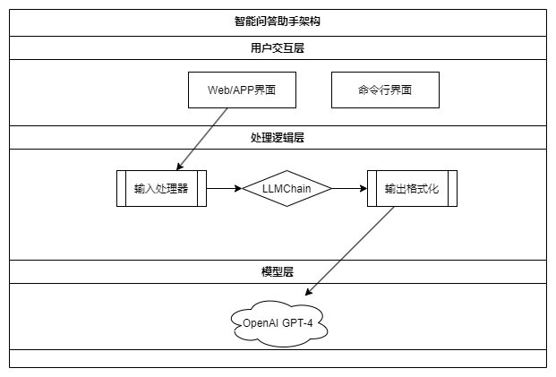

# 手把手教你搭建智能问答助手：基于LangChain和OpenAI/DeepSeek的实战教程

## 1. 教程概述
本教程将带您从零开始搭建一个**智能问答助手**，使用LangChain框架和OpenAI语言模型实现自然语言交互。适合AI入门开发者和对NLP应用感兴趣的读者学习。

  智能问答实现架构图如下：


## 2. 为什么需要问答助手？
▌在人工智能时代，问答系统是：
- 智能客服的基础组件 ✅  
- 知识管理的高效工具 💡  
- 复杂AI系统的核心模块 🧠

通过本教程您将掌握：
1. AI问答系统的基础原理
2. LangChain的核心使用方法
3. OpenAI/deepseek 模型集成技巧

## 3. 核心组件解析
### 3.1 语言模型
- 采用OpenAI GPT系列模型
- 支持自然语言理解和生成
- 参数说明：`temperature=0`保证答案确定性

### 3.2 提示词模板
```python
template = """
您是一个专业的AI助手，需要清晰准确地回答用户问题

用户问题：{question}

请用简洁的中文回答：
"""
```

### 3.3 LLM处理链
- 连接提示模板与语言模型
- 自动处理输入输出转换

## 4. 七步搭建问答系统
### 4.1 环境准备
#### 4.1.1 安装依赖库
```bash
pip install langchain-openai python-dotenv
```

#### 4.1.2 配置API密钥
1. 创建`.env`文件：
```ini
OPENAI_API_KEY=your_api_key_here
```
2. 加载环境变量：
```python
from dotenv import load_dotenv
load_dotenv()
```

### 4.2 初始化语言模型
```python

from langchain_openai import ChatOpenAI

llm = ChatOpenAI(
    model="gpt-4o-mini",
    max_tokens=1000,
    temperature=0  # 控制回答创造性
)


```
如果调用的是deepseek则：
```python
llm = ChatOpenAI(
    base_url="https://api.deepseek.com/v1",  # DeepSeek API端点
    model="deepseek-chat",                  # DeepSeek模型标识
    openai_api_key="sk-edxxxxxxxxxxxxxxxxxxxx",     # 替换为DeepSeek密钥
    max_tokens=1000,
    temperature=0
)
```
### 4.3 构建提示模板
```python
from langchain.prompts import PromptTemplate

template = """..."""  # 见3.2节模板
prompt = PromptTemplate.from_template(template)
```

### 4.4 创建处理管道
```python
qa_chain = prompt | llm  # 管道操作符连接组件
```

### 4.5 实现问答函数
```python
def get_answer(question):
    response = qa_chain.invoke({"question": question})
    return response.content
```

### 4.6 测试问答效果
```python
# 示例问题测试
test_question = "法国的首都是哪里？"
print(f"答案：{get_answer(test_question)}")

# 输出结果：
# 答案：法国的首都是巴黎。
```

### 4.7 实现交互界面
```python
while True:
    user_input = input("\n请输入问题（输入q退出）:")
    if user_input.lower() == 'q':
        break
    print(f"AI助手：{get_answer(user_input)}")
```

实现效果图如下：


## 5. 效果优化建议
### 5.1 扩展功能
1. 上下文记忆 🔄
   ```python
   from langchain.memory import ConversationBufferMemory
   ```
2. 知识库增强 📚
   ```python
   from langchain.retrievers import WikipediaRetriever
   ```

### 5.2 性能优化
- 增加流式响应 🚀
- 添加缓存机制 💾
- 实现异步处理 ⚡

## 6. 常见问题解答
### 6.1 如何提高回答质量？
- 优化提示词模板
- 调整temperature参数
- 添加示例对话

### 6.2 遇到API限流怎么办？
- 实现请求重试机制
- 使用指数退避算法
