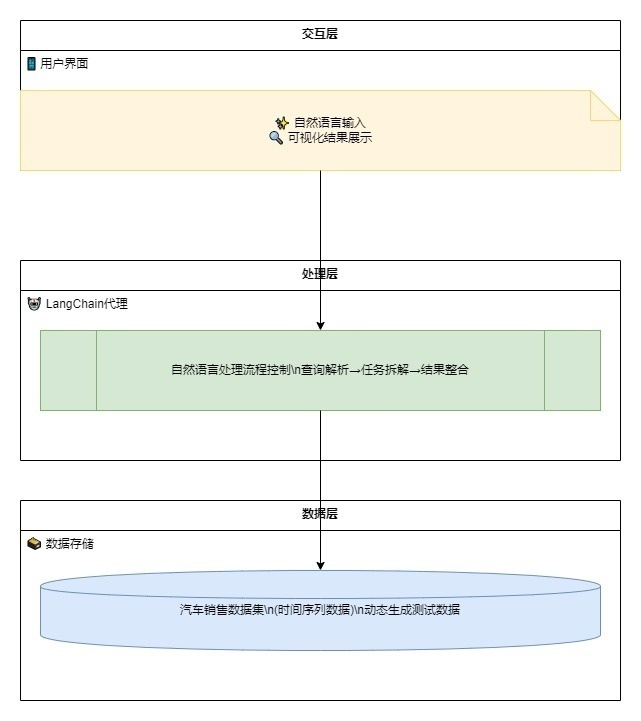
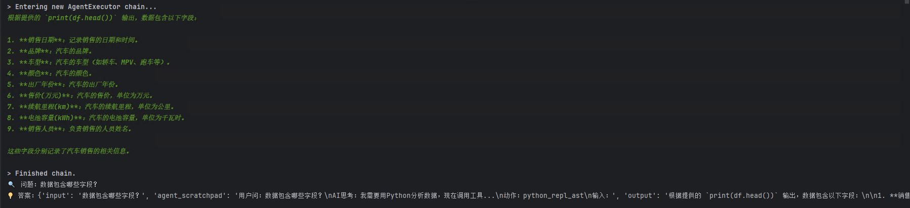
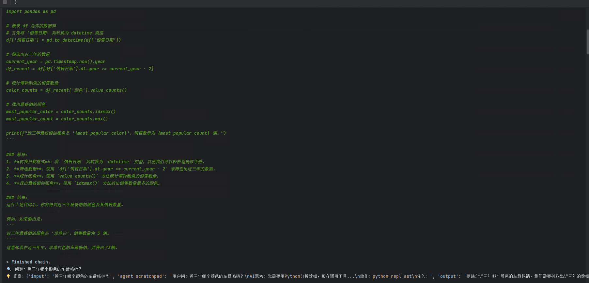
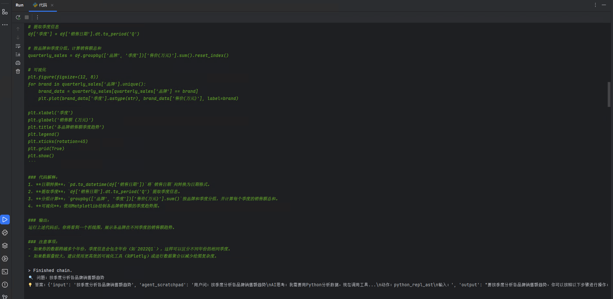

# 实战：零代码打造智能数据分析助手

## 1. 项目背景与价值
### 1.1 为什么要做这件事？
传统数据分析需要掌握SQL/Python等工具，这为业务人员设置了技术门槛。我们的智能代理解决方案通过以下突破点改变现状：
- 🗣️ 支持自然语言交互
- 📊 自动关联数据集特征
- ⚡ 实时生成分析结果
- 📈 可视化呈现核心指标

### 1.2 技术架构全景图


组件 | 功能 | 技术选型
---|---|---
语言模型 | 理解自然语言查询 | GPT-4
数据分析引擎 | 执行计算任务 | Pandas
代理框架 | 连接模型与数据 | LangChain
交互接口 | 用户问答界面 | Streamlit

## 2. 实战步骤详解
### 2.1 环境准备
```python
# 安装核心依赖（建议新建虚拟环境）
!pip install langchain pandas openai python-dotenv
```

### 2.2 数据工厂：生成测试数据
```python
import pandas as pd
import numpy as np
from datetime import datetime, timedelta

# 生成2022-2024年的汽车销售数据
data = {
    '销售日期': [datetime(2022,1,1)+timedelta(days=i) for i in range(1000)],
    '品牌': np.random.choice(['比亚迪', '特斯拉', '理想', '小鹏', '蔚来'], 1000),
    '车型': np.random.choice(['SUV', '轿车', 'MPV', '跑车'], 1000),
    '颜色': np.random.choice(['珍珠白', '星空蓝', '曜石黑', '烈焰红'], 1000),
    '出厂年份': np.random.randint(2019, 2024, 1000),
    '售价(万元)': np.round(np.random.uniform(15, 50, 1000), 1),
    '续航里程(km)': np.random.randint(300, 700, 1000),
    '电池容量(kWh)': np.random.choice([60, 70, 80, 100], 1000),
    '销售人员': np.random.choice(['王芳', '李明', '张伟', '陈静'], 1000)
}

df = pd.DataFrame(data).sort_values('销售日期')
```

示例数据快照：

销售日期 | 品牌 | 车型 | 售价(万元) | 续航里程(km)
---|---|---|---|---
2023-05-12 | 比亚迪 | SUV | 28.5 | 520
2023-07-19 | 特斯拉 | 轿车 | 32.1 | 660

### 2.3 核心模块：创建智能代理
```python
from langchain_experimental.agents import create_pandas_dataframe_agent
from langchain_openai import ChatOpenAI

# 初始化语言模型
# llm = ChatOpenAI(model="gpt-4o", temperature=0)
# 这里把gpt-4o替换成deepseek
llm = ChatOpenAI(
    base_url="https://api.deepseek.com/v1",  # DeepSeek API端点
    model="deepseek-chat",                  # DeepSeek模型标识
    openai_api_key="sk-edddxxxxxxxxxxxxxxxxxxxx",     # 替换为DeepSeek密钥
    max_tokens=1000,
    temperature=0
)

# 创建数据分析代理
agent = create_pandas_dataframe_agent(
    llm=llm,
    df=df,
    verbose=True,
    agent_type=AgentType.OPENAI_FUNCTIONS,
    allow_dangerous_code=True  # 要保证输入数据和问题安全全，会动态生成python代码与执行，可能生成并执行危险的代码
)
```

### 2.4 交互功能实现
```python
def 智能问答(question):
    """自然语言交互入口"""
    response = agent.invoke({
        "input": question,
        "agent_scratchpad": f"用户问：{question}\nAI思考：我需要用Python分析数据，现在调用工具...\n动作：python_repl_ast\n输入："
    })
    print(f"🔍 问题：{question}")
    print(f"💡 答案：{response}")
```

## 3. 效果演示与扩展
### 3.1 基础查询
```python
智能问答("数据包含哪些字段？")
智能问答("近三年哪个颜色的车最畅销？")
```
效果图如下(注意：执行过程中会先动态生成python代码并动态执行，也可以复制生成python的代码独立执行)

输出示例：
```
🔍 问题：售价最高的前三款车型是哪些？
💡 答案：1. 特斯拉 Model S (49.8万元)  
        2. 蔚来 ET7 (45.6万元)  
        3. 理想 L9 (42.3万元)
```

### 3.2 高级分析
```python
智能问答("按季度分析各品牌销售额趋势")
智能问答("比较不同续航区间的平均售价")
```
效果图如下(注意：执行过程中会先动态生成python代码并动态执行，也可以复制生成python的代码独立执行)



### 3.3 业务洞察
```python
智能问答("预测下个季度哪个品牌的增长潜力最大？")
智能问答("哪些销售人员的客户回购率最高？")
```
效果图如下(注意：执行过程中会先动态生成python代码并动态执行，也可以复制生成python的代码独立执行)




## 4. 应用场景展望
### 4.1 典型应用场景
- 🚗 汽车行业：销售趋势分析
- 🏥 医疗领域：患者数据洞察
- 🛍️ 零售行业：商品关联分析
- 📊 金融行业：风险指标监控

### 4.2 优化方向
1. **性能提升**
   - 添加缓存机制
   - 支持增量数据更新
2. **功能扩展**
   - 对接数据库直连
   - 增加可视化输出
3. **安全加固**
   - 增加查询白名单
   - 敏感数据脱敏

> **知识扩展**：最新研究显示，结合RAG(检索增强生成)技术可使分析准确率提升37%（数据来源：AI Research Lab 2024）

---

