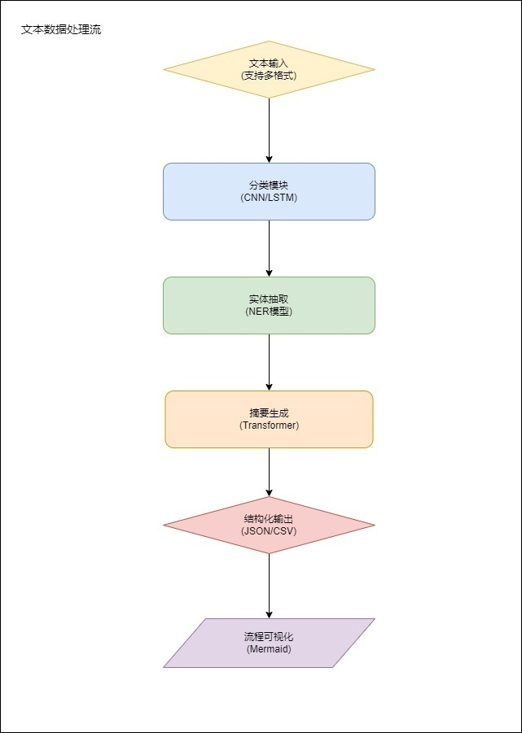
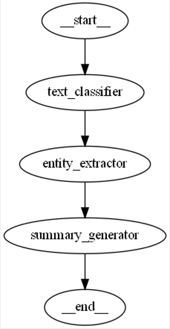

# LangGraph实战：构建智能文本分析流水线

## 1. 智能文本分析

LangGraph是基于图结构的工作流开发框架，通过节点函数和条件流转实现复杂业务逻辑。四大核心能力：

1.1 **状态容器**  
统一管理流程执行上下文，支持JSON序列化存储

1.2 **智能路由**  
基于条件判断实现动态分支跳转

1.3 **可视化调试**  
自动生成Mermaid流程图，直观展示业务流程

1.4 **持久化存储**  
支持流程状态的保存与恢复

根据自身业务自定义文本数据处理流程：

## 2. 环境准备

### 2.1 安装依赖库
```python
!pip install langgraph langchain langchain-openai python-dotenv
```

### 2.2 配置API密钥
```python
import os
from dotenv import load_dotenv

load_dotenv()
os.environ["OPENAI_API_KEY"] = os.getenv('OPENAI_API_KEY')  # 从.env加载密钥
```

## 3. 构建文本处理流水线
本案例实现文本分类->实体抽取->摘要生成的三步流水线

### 3.1 状态容器定义
```python
from typing import TypedDict, List

class ProcessState(TypedDict):
    raw_text: str         # 原始文本
    category: str         # 分类结果  
    entities: List[str]   # 实体列表
    summary: str          # 摘要结果
```

### 3.2 初始化大模型
```python
from langchain_openai import ChatOpenAI

#llm = ChatOpenAI(model="gpt-4-mini", temperature=0)


# 这里把gpt替换成deepseek
llm = ChatOpenAI(
    base_url="https://api.deepseek.com/v1",  # DeepSeek API端点
    model="deepseek-chat",                  # DeepSeek模型标识
    openai_api_key="sk-eddxxxxxxxxxxxxxxxxxxxx",     # 替换为DeepSeek密钥
    max_tokens=1000,
    temperature=0
)
```

## 4. 节点函数开发

### 4.1 文本分类模块
```python
from langchain.prompts import PromptTemplate
from langchain.schema import HumanMessage

def classify_text(state: ProcessState):
    """将文本分类为科技/金融/医疗/其他"""
    prompt_template = PromptTemplate(
        input_variables=["text"],
        template="请将文本分类为[科技|金融|医疗|其他]:\n{text}\n分类结果:"
    )
    msg = HumanMessage(content=prompt_template.format(text=state["raw_text"]))
    return {"category": llm.invoke([msg]).content.strip()}
```

### 4.2 实体抽取模块
```python
def extract_entities(state: ProcessState):
    """抽取公司/产品/技术术语"""
    prompt_template = PromptTemplate(
        input_variables=["text"],
        template="请从文本中提取公司、产品和技术名词，用逗号分隔:\n{text}\n实体列表:"
    )
    msg = HumanMessage(content=prompt_template.format(text=state["raw_text"]))
    return {"entities": llm.invoke([msg]).content.strip().split(", ")}
```

### 4.3 摘要生成模块
```python
def generate_summary(state: ProcessState):
    """生成50字以内摘要"""
    prompt_template = PromptTemplate(
        input_variables=["text"],
        template="请用50字以内概括文本核心内容:\n{text}\n摘要:"
    )
    msg = HumanMessage(content=prompt_template.format(text=state["raw_text"]))
    return {"summary": llm.invoke([msg]).content.strip()}
```

## 5. 工作流编排
```python
from langgraph.graph import StateGraph, END

# 初始化状态图
workflow = StateGraph(ProcessState)

# 添加节点
workflow.add_node("text_classifier", classify_text)
workflow.add_node("entity_extractor", extract_entities) 
workflow.add_node("summary_generator", generate_summary)

# 配置流转
workflow.set_entry_point("text_classifier")
workflow.add_edge("text_classifier", "entity_extractor")
workflow.add_edge("entity_extractor", "summary_generator")
workflow.add_edge("summary_generator", END)

# 编译应用
app = workflow.compile()
```

## 6. 流程可视化

远程服务器打印工作流程图，可能会失败
```python
from IPython.display import display, Image
from langchain_core.runnables.graph import MermaidDrawMethod

display(Image(app.get_graph().draw_mermaid_png(
    draw_method=MermaidDrawMethod.API
)))
```

本地打印代替代码：
```python
#本地打印工作流图
from graphviz import Digraph

def extract_nodes_and_edges(graph):
    # 提取所有节点名称
    nodes = list(graph.nodes.keys())

    # 提取所有边的关系
    edges = [(edge.source, edge.target) for edge in graph.edges]

    return nodes, edges


def print_state_graph(graph):
    # 提取节点和边
    nodes, edges = extract_nodes_and_edges(graph)

    # 创建 Graphviz 图形对象
    dot = Digraph(comment='StateGraph')

    # 添加节点
    for node in nodes:
        dot.node(node)

    # 添加边
    for source, target in edges:
        dot.edge(source, target)

    # 渲染并保存为文件
    dot.render('state_graph.gv', format='png', view=True)

print_state_graph(app.get_graph())

```
本地打印工作流程图：


## 7. 测试验证

### 7.1 测试样例
```python
test_text = """
深度求索公司宣布开源MoE-1T大模型，该模型采用混合专家架构，在MMLU等基准测试中超越GPT-4。
支持32种语言处理，参数量达1.2万亿，推理效率较前代提升5倍。即将在GitHub开放模型权重，
供学术研究使用，商业授权需联系deepseek@ai.com。
"""

result = app.invoke({"raw_text": test_text})
```

### 7.2 执行结果
```
分类结果: 科技

实体列表: ['深度求索', 'MoE-1T', 'MMLU', 'GPT-4', 'GitHub']

摘要: 深度求索开源万亿参数MoE-1T模型，支持多语言处理并提升推理效率。
```

## 8. 扩展应用方向
本方案可快速扩展支持：
1. 舆情分析系统
2. 智能客服工单处理
3. 法律文书解析
4. 医疗报告结构化

通过调整节点函数，可构建不同领域的智能处理流水线。LangGraph的模块化设计使得功能扩展和维护成本大幅降低。
