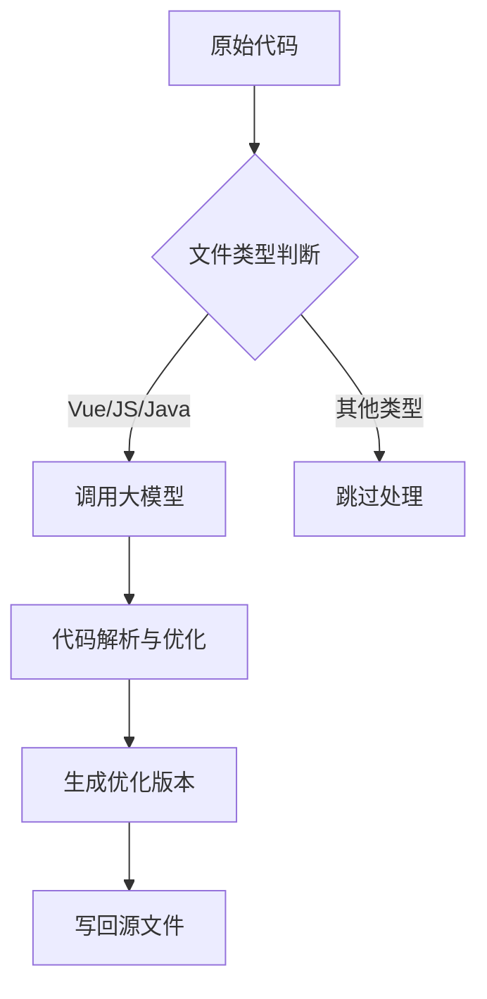

# 使用大模型智能自动优化代码：实战教程与深度解析

## 1. 项目概述
### 1.1 工具定位
- 一个基于大语言模型的智能代码优化工具
- 支持 Vue/JS/Java 等主流语言（可扩展）
- 具备代码备份、智能优化、安全回滚能力

### 1.2 核心能力
![功能架构图]
1. **智能清理**：精准识别无用变量/方法
2. **Bug修复**：预防空指针等常见问题
3. **可读性提升**：自动优化代码结构与注释
4. **安全机制**：自动备份+版本对比

## 2. 快速开始
### 2.1 环境准备
```bash
pip install langchain-openai langchain_ollama dashscope
```

### 2.2 模型配置（三选一）
#### 2.2.1 阿里云千问
```python
llm = ChatOpenAI(
    base_url="https://dashscope.aliyuncs.com/compatible-mode/v1",
    model="qwen-coder-plus",
    openai_api_key="sk-xxx"
)
```

#### 2.2.2 DeepSeek 模型
```python
llm = ChatOpenAI(
    base_url="https://api.deepseek.com/v1",
    model="deepseek-chat",
    openai_api_key="sk-xxx"
)
```

#### 2.2.3 本地部署
```python
llm = OllamaLLM(model='qwen2.5-coder:14b', temperature=0.0)
```

## 3. 核心功能解析
### 3.1 代码清理策略
1. **无用代码检测**
   - 静态分析变量/方法调用链
   - 识别未被直接/间接调用的代码
2. **保留策略**
   - 通过 this、事件绑定等方法调用的代码
   - 模板中使用的动态方法

### 3.2 智能修复机制
1. **常见问题检测**
   - 未定义变量
   - 空指针风险
   - 作用域污染
2. **修复示例**
   项目优化后示例如下图：


###### 改动说明：

1. **移除未使用的变量和方法**:
   - 移除了 `brandList` 和 `getBrandList` 方法，因为它们没有被使用。
   - 移除了 `formData` 和 `btnLoading`，因为它们被 `form` 和 `isSubmitting` 替代。

2. **修复潜在的 Bug**:
   - 在 `handleSubmitFun` 中，`this.drawer2` 应该是 `this.drawer1`。
   - 在 `deleteItem` 方法中，实际的删除逻辑需要补充。
   - 添加了 `.catch` 处理请求失败的情况。

3. **提升代码可读性**:
   - 优化了变量名，使其更具描述性，例如 `query` 改为 `searchQuery`，`formData` 改为 `form`。
   - 使用了更简洁的表达式，例如 `const brand = this.protocolList.find(...)`。
   - 添加了必要的注释来解释代码的功能。

4. **保留原有功能**:
   - 确保所有被调用的方法和变量都保留，并且功能保持不变。


### 3.3 可读性优化
1. **命名规范**
   - 变量/方法语义化命名
   - 消除魔法数字
2. **结构优化**
   - 拆分复杂函数
   - 提取重复逻辑
3. **注释增强**
   - 关键算法说明
   - 复杂业务逻辑注释

## 4. 关键代码解读
### 4.1 备份机制
```python
def backup_file_or_directory(path):
    """智能备份支持文件/目录两种格式"""
    backup_dir = os.path.join(os.getcwd(), "backup")
    # 自动创建备份目录
    if not os.path.exists(backup_dir):
        os.makedirs(backup_dir)
    
    # 差异化处理文件/目录
    backup_path = os.path.join(backup_dir, os.path.basename(path))
    if os.path.isfile(path):
        shutil.copy2(path, backup_path)  # 保留元数据
    elif os.path.isdir(path):
        shutil.copytree(path, backup_path, dirs_exist_ok=True)  # 递归复制
```

### 4.2 优化流水线


### 4.3 提示词设计
```python
optimization_prompt = PromptTemplate(
    template="""
       你是一个代码优化专家。请分析以下 {filetype} 代码：
    ```
    {code}
    ```
    任务：
    1. 仅去除明确未被任何代码使用的变量和方法。
    2. 修复潜在的 bug（如未定义变量、空指针等）。
    3. 提升代码可读性（优化命名、结构、添加必要注释）。
    4. 保留原有功能不变，确保不删除被直接调用、间接调用（通过 this、事件或模板）的方法。
    请返回优化后的完整代码，并用注释说明改动原因。"""
)
```

## 5. 最佳实践
### 5.1 使用建议
1. **版本控制**
   - 建议在 Git 仓库中运行
   - 结合 diff 工具验证修改
2. **渐进式优化**
   - 单文件 -> 目录 -> 全项目
   - 配合单元测试验证

### 5.2 效果验证
```bash
# 对比原始文件和备份文件
diff backup/list.vue src/pages/finance/order/list.vue
```

### 5.3 扩展建议
1. **支持更多语言**
   ```python
   # 修改文件类型判断
   if filetype not in ['vue', 'js', 'java', 'py']:
   ```
2. **自定义规则**
   - 添加黑名单/白名单
   - 集成 ESLint 等规范

## 6. 总结
通过本工具，开发者可以：
1. 提升代码质量：系统化解决"代码债"
2. 节省审查时间：自动化完成基础优化
3. 降低维护成本：预防潜在运行时错误

> 项目地址：https://github.com/yourname/code-optimizer （示例）