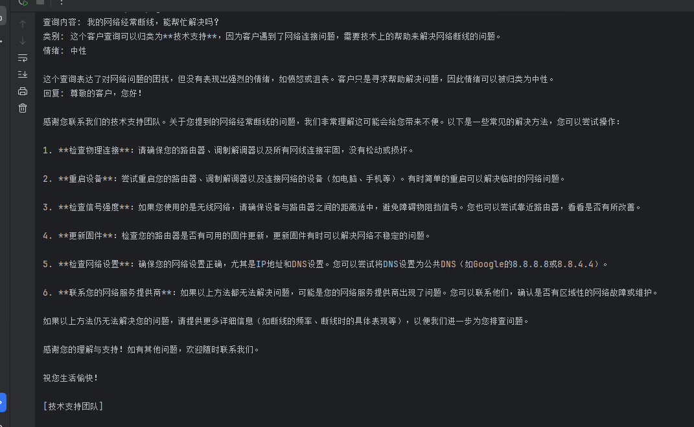
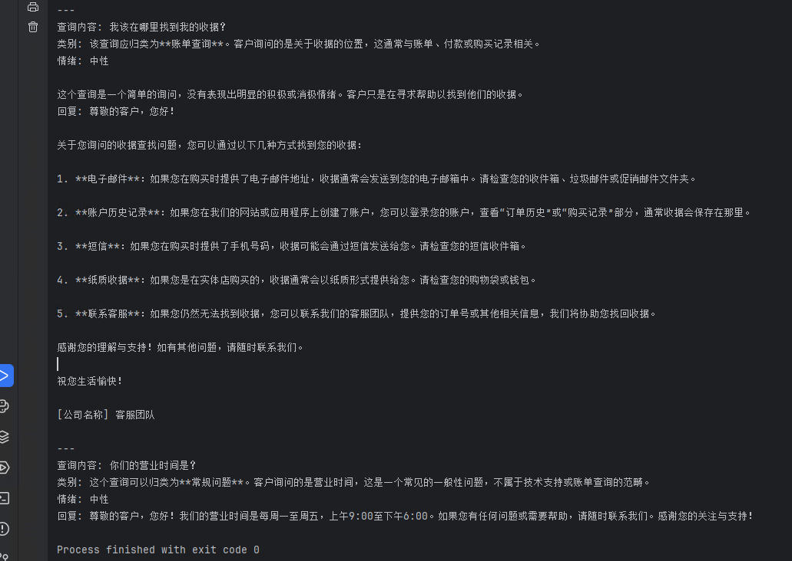

# 1. 使用 LangGraph 构建智能客服代理系统（DeepSeek 版）

本教程展示如何使用 LangGraph 和 DeepSeek 构建一个智能客服代理系统。该系统能够对客户查询进行分类、情绪分析，并根据不同情况生成相应回复或将问题上报给人工客服。整个流程将结合先进的自然语言处理技术和图形化工作流管理，适用于多种客户支持场景。

---

## 2. 教程概述

本教程主要包括以下内容：

- **背景与动机**：为何构建智能客服系统至关重要？
- **系统关键组件**：介绍系统中各模块的作用和流程。
- **方法细节**：从环境配置到工作流构建的完整步骤。
- **代码实现**：详细的代码示例，包括状态定义、节点函数、图构建、流程可视化及客服代理函数的实现。

---

## 3. 背景与动机

### 3.1 背景

在当今快节奏的商业环境中，高效、准确的客户支持至关重要。自动化处理客户的初步查询能够显著降低响应时间，并提升整体客户体验。通过将自然语言处理与图形化工作流结合，我们可以构建一个能够自动分类、情绪分析并生成回复的智能客服系统。

### 3.2 动机

1. **提升客户体验**  
   自动响应常见问题，让客户更快获得帮助。

2. **降低运营成本**  
   减少人工客服压力，使团队能够专注处理更复杂的问题。

3. **系统扩展性**  
   通过模块化设计，可根据业务需求灵活扩展或定制功能。

---

## 4. 系统关键组件

### 4.1 状态管理
使用 `TypedDict` 定义每次客户交互的状态，包含查询文本、类别、情绪及回复内容。

### 4.2 查询分类
将客户查询自动归类为“技术支持”、“账单查询”或“常规问题”。

### 4.3 情绪分析
对查询进行情绪分析，判断为“积极”、“中性”或“消极”。

### 4.4 回复生成
针对不同类别和情绪生成相应的自动回复。

### 4.5 升级处理
若客户查询情绪为“消极”，系统将自动上报给人工客服进行进一步处理。

### 4.6 工作流图构建
利用 LangGraph 构建图形化工作流，将各个处理节点连接起来，实现完整的客服处理流程。

---

## 5. 方法细节与代码实现

以下代码展示了如何使用 DeepSeek 作为后端语言模型，通过 LangGraph 构建智能客服系统。

### 5.1 导入库与配置 DeepSeek LLM

```python
from typing import Dict, TypedDict

from langgraph.constants import START
from langgraph.graph import StateGraph, END
from langchain_core.prompts import ChatPromptTemplate
from langchain_openai import ChatOpenAI
from langchain_core.runnables.graph import MermaidDrawMethod

# 使用 DeepSeek 替代 OpenAI
def llm():
    return ChatOpenAI(
        base_url="https://api.deepseek.com/v1",
        model="deepseek-chat",
        openai_api_key="sk-eddxxxxxxxxxxxxxxxxxxxxxxxxxxxxx",
        max_tokens=10000,
        temperature=0
    )
```

### 5.2 定义状态结构

```python
class State(TypedDict):
    query: str
    category: str
    sentiment: str
    response: str
```

### 5.3 定义节点函数

#### 5.3.1 查询分类函数

```python
def categorize(state: State) -> State:
    """将客户查询归类为：技术支持、账单查询、常规问题。"""
    prompt = ChatPromptTemplate.from_template(
        "将以下客户查询归类为：技术支持、账单查询、常规问题。查询内容：{query}"
    )
    chain = prompt | llm()
    category = chain.invoke({"query": state["query"]}).content
    return {"category": category}
```

#### 5.3.2 情绪分析函数

```python
def analyze_sentiment(state: State) -> State:
    """对客户查询进行情绪分析，判断为积极、中性或消极。"""
    prompt = ChatPromptTemplate.from_template(
        "分析以下客户查询的情绪。请回复 '积极'、'中性' 或 '消极'。查询内容：{query}"
    )
    chain = prompt | llm()
    sentiment = chain.invoke({"query": state["query"]}).content
    return {"sentiment": sentiment}
```

#### 5.3.3 回复生成函数

```python
def handle_technical(state: State) -> State:
    """针对技术支持问题生成回复。"""
    prompt = ChatPromptTemplate.from_template(
        "请为以下技术问题生成技术支持回复：{query}"
    )
    chain = prompt | llm()
    response = chain.invoke({"query": state["query"]}).content
    return {"response": response}

def handle_billing(state: State) -> State:
    """针对账单问题生成回复。"""
    prompt = ChatPromptTemplate.from_template(
        "请为以下账单问题生成账单支持回复：{query}"
    )
    chain = prompt | llm()
    response = chain.invoke({"query": state["query"]}).content
    return {"response": response}

def handle_general(state: State) -> State:
    """针对常规问题生成回复。"""
    prompt = ChatPromptTemplate.from_template(
        "请为以下查询生成常规支持回复：{query}"
    )
    chain = prompt | llm()
    response = chain.invoke({"query": state["query"]}).content
    return {"response": response}
```

#### 5.3.4 升级处理函数

```python
def escalate(state: State) -> State:
    """因消极情绪将查询上报给人工客服。"""
    return {"response": "由于查询情绪消极，此问题已上报给人工客服。"}
```

#### 5.3.5 路由函数

```python
def route_query(state: State) -> str:
    """根据情绪和类别路由，情绪消极时优先升级"""
    if state["sentiment"] == "消极":
        return "升级处理"
    if state["category"] == "技术支持":
        return "处理技术问题"
    elif state["category"] == "账单查询":
        return "处理账单问题"
    else:
        return "处理一般问题"
```

### 5.4 构建与配置工作流图

```python
# 创建工作流图
workflow = StateGraph(State)

# 添加节点
workflow.add_node("分类", categorize)
workflow.add_node("情绪分析", analyze_sentiment)  # 确保存在此节点
workflow.add_node("处理技术问题", handle_technical)
workflow.add_node("处理账单问题", handle_billing)
workflow.add_node("处理一般问题", handle_general)
workflow.add_node("升级处理", escalate)

# 连接节点：从入口 START 到分类
workflow.add_edge(START, "分类")

# 分类节点后接情绪分析节点
workflow.add_edge("分类", "情绪分析")

# 根据情绪分析的结果，通过条件路由转发到对应处理节点
workflow.add_conditional_edges(
    "情绪分析",  # 条件路由起点
    route_query,
    {
        "处理技术问题": "处理技术问题",
        "处理账单问题": "处理账单问题",
        "处理一般问题": "处理一般问题",
        "升级处理": "升级处理"
    }
)

# 所有处理节点均连接到工作流结束 END
workflow.add_edge("处理技术问题", END)
workflow.add_edge("处理账单问题", END)
workflow.add_edge("处理一般问题", END)
workflow.add_edge("升级处理", END)

# 设置入口并编译工作流
workflow.set_entry_point("分类")
app = workflow.compile()
```

### 5.5 可视化工作流图

以下代码用于生成并保存工作流图的图片（此部分非必须，仅用于调试和展示流程图）：

```python
# 在不改变第三方库代码的情况下，动态修改部分库方法以适应本地环境
import pyppeteer

# 保存原始 launch 方法
_original_launch = pyppeteer.launch

# 定义新的 launch 方法，强制传入 chrome 执行路径
async def patched_launch(*args, **kwargs):
    kwargs['executablePath'] = r'Z:\src\ai\ai_agent\lib\chrome-win64\chrome.exe'
    return await _original_launch(*args, **kwargs)

# 替换 launch 方法
pyppeteer.launch = patched_launch

from pyppeteer.frame_manager import Frame

_original_addScriptTag = Frame.addScriptTag

async def patched_addScriptTag(self, options):
    if options.get('url') == 'https://cdn.jsdelivr.net/npm/mermaid/dist/mermaid.min.js':
        # 替换为本地 mermaid 文件内容
        options.pop('url')
        local_file = r'Z:\src\ai\ai_agent\lib\mermaid.min.js'
        with open(local_file, 'r', encoding='utf8') as f:
            js_content = f.read()
        options['content'] = js_content
    return await _original_addScriptTag(self, options)

Frame.addScriptTag = patched_addScriptTag

# 绘制并保存流程图
img_bytes = app.get_graph().draw_mermaid_png(draw_method=MermaidDrawMethod.PYPPETEER)
with open('7_output.png', 'wb') as f:
    f.write(img_bytes)
print("图片已保存到 7_output.png")
```

### 5.6 客户查询处理函数

```python
def run_customer_support(query: str) -> Dict[str, str]:
    """
    通过 LangGraph 工作流处理客户查询。
    
    参数:
        query (str): 客户查询内容
        
    返回:
        Dict[str, str]: 包含查询类别、情绪和回复的字典
    """
    results = app.invoke({"query": query}, debug=False)
    return {
        "category": results["category"],
        "sentiment": results["sentiment"],
        "response": results["response"]
    }
```

---

## 6. 系统测试示例

通过以下示例验证客服代理系统的效果，每个示例对应一种查询类型：

### 6.1 消极情绪查询（上报人工客服）

```python
query = "我的网络经常断线，能帮忙解决吗？"
result = run_customer_support(query)
print(f"查询内容: {query}")
print(f"类别: {result['category']}")
print(f"情绪: {result['sentiment']}")
print(f"回复: {result['response']}")
print("\n")
```
运行后效果如下图 ：


### 6.2 账单查询 与 常规问题查询

```python
query = "我该在哪里找到我的收据？"
result = run_customer_support(query)
print(f"查询内容: {query}")
print(f"类别: {result['category']}")
print(f"情绪: {result['sentiment']}")
print(f"回复: {result['response']}")
print("\n")

query = "你们的营业时间是？"
result = run_customer_support(query)
print(f"查询内容: {query}")
print(f"类别: {result['category']}")
print(f"情绪: {result['sentiment']}")
print(f"回复: {result['response']}")
```
运行后效果如下图 ：



---

## 7. 总结

本教程详细介绍了如何利用 LangGraph 和 DeepSeek 构建一个智能客服代理系统。通过定义状态管理、节点函数以及工作流图，我们实现了对客户查询的自动分类、情绪分析与响应生成。当查询情绪为“消极”时，系统会自动上报给人工客服，从而确保问题得到妥善处理。该系统不仅提升了客户支持效率，也为后续功能扩展提供了良好的基础。
