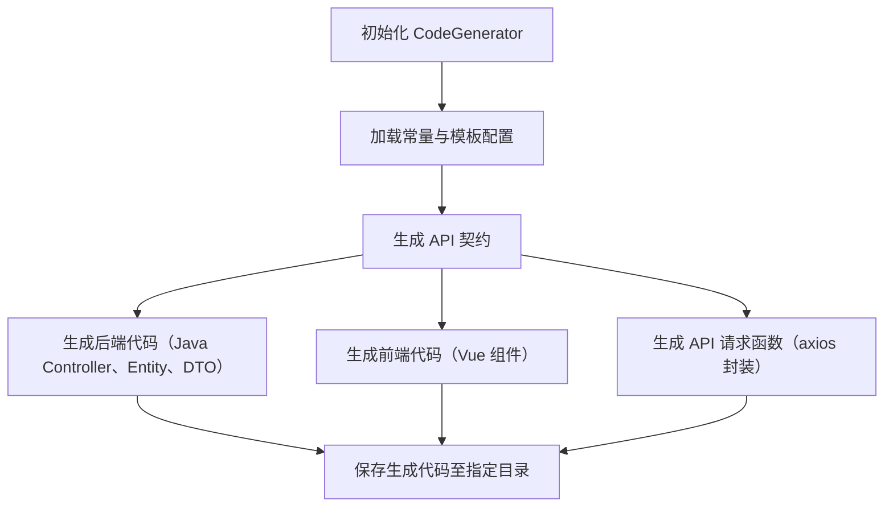
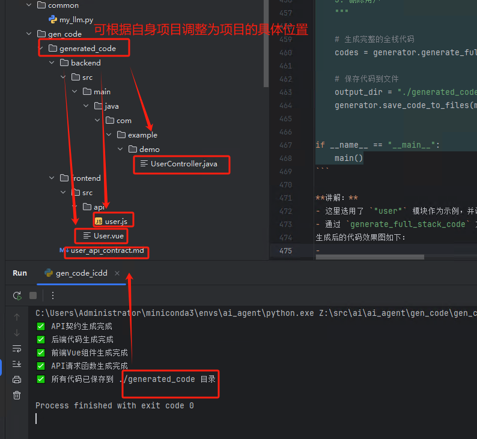
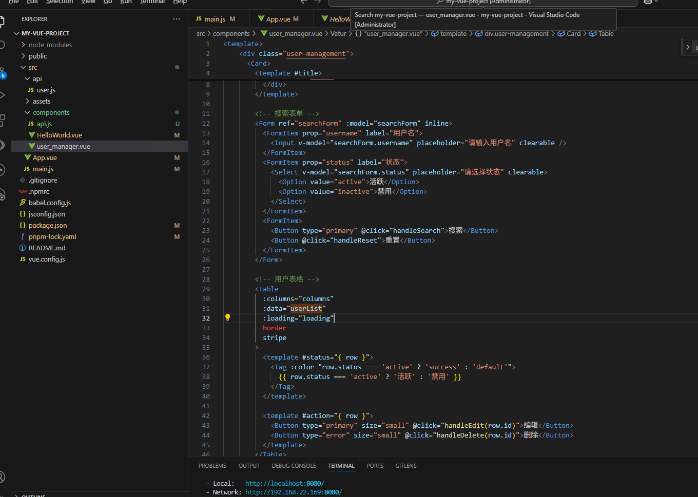
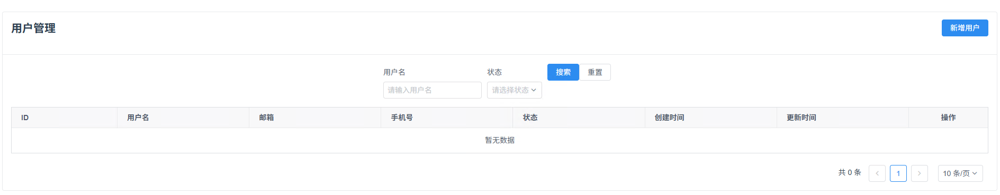

# 【全栈神器】批量代码生成模块：轻松应对大模型 Token 限制与代码关联难题！

在大模型开发过程中，经常遇到一次性提交过多示例代码（如 Vue、JavaScript、Java 代码）而超出 Token 限制的问题，导致模型理解不准确、回复不精准。本文介绍了一套批量代码生成模块，通过分步骤生成 API 契约、后端代码、前端代码与 API 请求函数，有效解决这类痛点。

---

# 1. 教程概览

本教程主要分为以下几个部分：

1.1 **背景介绍**  
   简述大模型代码生成时遇到的问题以及为何需要批量代码生成模块。

1.2 **模块架构与流程图解析**  
   介绍模块的整体设计思路，并结合流程图展示工作流程。

1.3 **详细实现代码生成讲解**  
   分步解释代码的关键部分，详细剖析生成代码逻辑。

1.4 **实战示例与代码保存**  
   讲解如何利用生成器生成全栈代码，并将代码写入文件保存。

1.5 **总结与展望**  
   总结本模块的优势与应用场景，并展望未来的扩展方向。

---

# 2. 模块架构与工作流程

## 2.1 设计目的与优势

2.1.1 **解决 Token 限制问题**  
   当一次性提交过多代码时，生成的 Token 数量很大，导致大模型理解出现偏差。通过批量生成 API 契约和代码，各部分代码单独生成，既不会超限，也保证了整体一致性。

2.1.2 **关联前后端代码**  
   单独生成前端代码与后端代码容易出现关联性断裂，本模块通过统一的 API 契约将前后端统一起来，确保接口规范一致。

2.1.3 **自动化生成全栈代码**  
   通过一套完整的流程生成 API 契约、Java 后端代码、Vue 前端组件以及 API 请求函数，提升开发效率，降低调试风险。

## 2.2 流程图解析

下面的流程图展示了模块整体架构及工作流程：



**说明：**  
- **A、B:** 初始化生成器后加载所有常量与提示模板；  
- **C:** 根据模块名称和功能描述生成 API 契约；  
- **D、E、F:** 分别生成后端、前端与 API 请求函数代码；  
- **G:** 最后将所有生成代码保存到指定目录，保持项目结构清晰。

---

# 3. 代码详细讲解与插入

在本部分，我们将分层详细讲解原始代码中每个模块的实现，并在关键位置插入代码以便理解。

## 3.1 常量和提示模板的定义

### 3.1.1 常量类 `Constants`

`Constants` 类中定义了 API 契约、后端、前端以及 API 请求函数的系统提示与模板，这些模板描述了具体生成代码的要求，确保生成结果符合规范。

```python
class Constants:
    # API契约相关提示词
    API_CONTRACT_SYSTEM_PROMPT = """你是一位专业的全栈开发工程师。你的任务是设计一个模块的API契约，包括前后端交互的接口规范。
    契约应该清晰地定义每个API的URL路径、HTTP方法、请求参数和返回数据结构。"""

    API_CONTRACT_PROMPT_TEMPLATE = """为{module_name}模块设计一个完整的API契约。

    该模块的主要功能是：{module_description}

    请提供以下内容：
    1. 该模块所需的所有API端点列表
    2. 每个API的详细规范，包括：
       - URL路径
       - HTTP方法(GET/POST)
       - 请求参数(包括路径参数、查询参数和请求体)
       - 成功响应的数据结构

    请确保API设计符合RESTful规范，并适合前后端分离的架构。
    """
    # 后端代码生成提示词
    BACKEND_SYSTEM_PROMPT = """你是一位专业的Java后端开发工程师，精通Spring Boot2框架。
    你的任务是根据提供的API契约，编写符合规范的Java控制器代码，确保代码风格一致、注释完善。"""

    BACKEND_PROMPT_TEMPLATE = """请根据以下API契约，编写一个完整的Java控制器类来实现{module_name}模块的后端接口。

    API契约:
    {api_contract}

    请提供以下内容：
    1. 控制器类(Controller)代码
    2. 必要的实体类(Entity)代码
    3. 必要的数据传输对象(DTO)或值对象(VO)代码

    代码要符合Spring Boot2最佳实践，包含完整的Java注解、参数验证、异常处理和详细注释。
    """
    # 前端代码生成提示词
    FRONTEND_SYSTEM_PROMPT = """你是一位专业的Vue.js前端开发工程师，精通Vue 2和iView UI框架。
    你的任务是根据提供的API契约，编写符合规范的Vue组件代码，确保代码风格一致、交互体验良好。"""

    FRONTEND_PROMPT_TEMPLATE = """请根据以下API契约，编写一个完整的Vue 2组件来实现{module_name}模块的前端界面。

    API契约:
    {api_contract}

    请提供以下内容：
    1. Vue组件(.vue文件)，包含template、script和style部分
    2. API请求函数(推荐放在单独的api文件中)

    代码要符合Vue 2 Composition API的最佳实践，使用iView组件库，实现以下功能：
    1. 查询条件，如果需求未指定查询条件的需要选择合理的列表字段作为查询条件
    2. 数据列表显示,默认显示三条未示例记录数据
    3. 分页、排序和筛选(如适用)
    4. 表单提交和验证(如适用)
    5. 必要的CRUD操作
    6. 良好的错误处理和用户反馈
    """
    # API请求函数生成提示词
    API_FUNCTIONS_SYSTEM_PROMPT = """你是一位专业的前端开发工程师，精通JavaScript和API交互。
    你的任务是根据提供的API契约，编写用于与后端交互的API请求函数，确保代码清晰易用。"""

    API_FUNCTIONS_PROMPT_TEMPLATE = """请根据以下API契约，编写一组用于{module_name}模块的API请求函数。

    API契约:
    {api_contract}

    请使用axios库(或类似的HTTP客户端库)编写这些函数，确保：
    1. 函数命名清晰，符合模块功能
    2. 函数参数类型合适，与API契约匹配
    3. 提供完整的JSDoc注释，说明参数和返回值
    4. 函数应该位于一个独立的JS/TS文件中，便于导入使用
    """
```

**讲解：**  
- 这里的提示模板为后续代码生成提供了详细的任务描述与格式要求，是模块化生成代码的基础。  
- 各模板中通过占位符 `{module_name}` 和 `{module_description}` 将用户传入的模块信息动态嵌入生成内容。

---

## 3.2 代码生成器的初始化与模板加载

### 3.2.1 CodeGenerator 类

`CodeGenerator` 类负责整体代码生成的核心逻辑。它在初始化时加载常量与提示模板，并调用大模型接口进行链式调用生成 API 契约与代码。

```python
class CodeGenerator:
    def __init__(self, llm_name: Optional[str] = None):
        """初始化代码生成器。

        Args:
            llm_name: 模型名称
        """
        self.constants = Constants()
        self.llm = get_language_model()

        # 初始化输出解析器
        self.output_parser = StrOutputParser()

        # 初始化提示模板
        self._init_prompt_templates()

    def _init_prompt_templates(self):
        """初始化各种提示模板"""
        # API契约提示模板
        self.api_contract_prompt = PromptTemplate(
            template=self.constants.API_CONTRACT_PROMPT_TEMPLATE,
            input_variables=["module_name", "module_description"]
        )

        # 后端代码提示模板
        self.backend_prompt = PromptTemplate(
            template=self.constants.BACKEND_PROMPT_TEMPLATE,
            input_variables=["module_name", "api_contract"]
        )

        # 前端代码提示模板
        self.frontend_prompt = PromptTemplate(
            template=self.constants.FRONTEND_PROMPT_TEMPLATE,
            input_variables=["module_name", "api_contract"]
        )

        # API请求函数提示模板
        self.api_functions_prompt = PromptTemplate(
            template=self.constants.API_FUNCTIONS_PROMPT_TEMPLATE,
            input_variables=["module_name", "api_contract"]
        )
```

**讲解：**  
- 构造函数中初始化了 `Constants`，通过 `get_language_model()` 获取后端大模型接口，保证生成的代码风格统一且符合预设要求。  
- 方法 `_init_prompt_templates` 分别实例化各个提示模板，便于后续调用生成不同部分的代码。

---

## 3.3 各部分代码生成方法

接下来介绍通过链式调用，如何生成 API 契约、后端代码、前端代码与 API 请求函数。

### 3.3.1 生成 API 契约

生成 API 契约时，利用模块名称与功能描述，通过提示模板动态生成接口规范文档。

```python
def generate_api_contract(self, module_name: str, module_description: str) -> str:
    """生成API契约。

    Args:
        module_name: 模块名称
        module_description: 模块功能描述

    Returns:
        生成的API契约
    """
    chain = self.api_contract_prompt | self.llm | self.output_parser

    return chain.invoke({
        "module_name": module_name,
        "module_description": module_description
    })
```

**讲解：**  
- 此方法构造了一个链，将提示模板、语言模型和输出解析器串联起来。  
- 调用 `chain.invoke` 时，将模块信息传入，大模型根据提示生成详细的 API 设计文档。

### 3.3.2 生成后端代码

根据生成的 API 契约，调用后端模板生成符合 Spring Boot2 风格的 Java 控制器代码。

```python
def generate_backend_code(self, module_name: str, api_contract: str) -> str:
    """生成后端Java代码。

    Args:
        module_name: 模块名称
        api_contract: API契约

    Returns:
        生成的后端代码
    """
    chain = self.backend_prompt | self.llm | self.output_parser

    return chain.invoke({
        "module_name": module_name,
        "api_contract": api_contract
    })
```

**讲解：**  
- 方法内部同样采用链式调用，将 API 契约和模块名称传入后端提示模板，生成符合要求的 Java 后端代码。  
- 同时支持生成控制器、实体类以及 DTO 等代码组件。

### 3.3.3 生成前端代码

前端代码生成主要针对 Vue 组件，利用 API 契约生成包含 template、script 和 style 部分的组件代码。

```python
def generate_frontend_code(self, module_name: str, api_contract: str) -> str:
    """生成前端Vue代码。

    Args:
        module_name: 模块名称
        api_contract: API契约

    Returns:
        生成的前端代码
    """
    chain = self.frontend_prompt | self.llm | self.output_parser

    return chain.invoke({
        "module_name": module_name,
        "api_contract": api_contract
    })
```

**讲解：**  
- 调用该方法后，大模型会根据 API 契约生成完整的 Vue 组件代码，适配 Vue 2 与 iView UI 框架，确保交互体验与代码质量。

### 3.3.4 生成 API 请求函数

前端页面与后端交互需要封装 API 请求函数，此方法使用 axios 封装请求，生成独立的 JS/TS 文件代码。

```python
def generate_api_functions(self, module_name: str, api_contract: str) -> str:
    """生成API请求函数。

    Args:
        module_name: 模块名称
        api_contract: API契约

    Returns:
        生成的API请求函数代码
    """
    chain = self.api_functions_prompt | self.llm | self.output_parser

    return chain.invoke({
        "module_name": module_name,
        "api_contract": api_contract
    })
```

**讲解：**  
- 类似其他代码生成方法，通过链式调用动态生成前端与后端 API 交互的函数代码，并确保参数、返回值和 JSDoc 注释完整。

---

## 3.4 全栈代码生成与代码保存

### 3.4.1 生成全栈代码

通过依次调用前述方法，完整生成 API 契约、后端代码、前端代码以及 API 请求函数。

```python
def generate_full_stack_code(self, module_name: str, module_description: str) -> Dict[str, str]:
    """生成完整的全栈代码。

    Args:
        module_name: 模块名称
        module_description: 模块功能描述

    Returns:
        包含所有生成代码的字典
    """
    # 1. 生成API契约
    api_contract = self.generate_api_contract(module_name, module_description)
    print(f"✅ API契约生成完成")

    # 2. 生成后端代码
    backend_code = self.generate_backend_code(module_name, api_contract)
    print(f"✅ 后端代码生成完成")

    # 3. 生成前端Vue组件
    frontend_code = self.generate_frontend_code(module_name, api_contract)
    print(f"✅ 前端Vue组件生成完成")

    # 4. 生成API请求函数
    api_functions = self.generate_api_functions(module_name, api_contract)
    print(f"✅ API请求函数生成完成")

    # 返回所有生成的代码
    return {
        "api_contract": api_contract,
        "backend_code": backend_code,
        "frontend_code": frontend_code,
        "api_functions": api_functions
    }
```

**讲解：**  
- 该方法按顺序调用各生成函数，并打印每一步执行状态，最终返回一个包含各部分代码的字典。  
- 这样既能保证代码生成流程完整，又方便后续进行文件保存。

### 3.4.2 将生成的代码保存到文件

将各部分生成代码分别保存到对应目录中，形成清晰的项目目录结构。

```python
def save_code_to_files(self, module_name: str, output_dir: str, code_dict: Dict[str, str]) -> None:
    """将生成的代码保存到文件中。

    Args:
        module_name: 模块名称
        output_dir: 输出目录
        code_dict: 包含所有生成代码的字典
    """
    # 创建必要的目录
    backend_dir = os.path.join(output_dir, "backend", "src", "main", "java", "com", "example", "demo")
    frontend_dir = os.path.join(output_dir, "frontend", "src")
    api_dir = os.path.join(frontend_dir, "api")

    os.makedirs(backend_dir, exist_ok=True)
    os.makedirs(frontend_dir, exist_ok=True)
    os.makedirs(api_dir, exist_ok=True)

    # 保存API契约
    with open(os.path.join(output_dir, f"{module_name}_api_contract.md"), "w", encoding='utf-8') as f:
        f.write(code_dict["api_contract"])

    # 保存后端代码 - 这里简化处理，实际上可能需要解析代码并分别保存到不同文件
    with open(os.path.join(backend_dir, f"{module_name.capitalize()}Controller.java"), "w", encoding='utf-8') as f:
        f.write(code_dict["backend_code"])

    # 保存前端Vue组件
    with open(os.path.join(frontend_dir, f"{module_name.capitalize()}.vue"), "w", encoding='utf-8') as f:
        f.write(code_dict["frontend_code"])

    # 保存API请求函数
    with open(os.path.join(api_dir, f"{module_name}.js"), "w", encoding='utf-8') as f:
        f.write(code_dict["api_functions"])

    print(f"✅ 所有代码已保存到 {output_dir} 目录")
```

**讲解：**  
- 方法中首先根据输出目录创建后端、前端与 API 请求函数的目录结构；  
- 随后将 API 契约、后端 Java 代码、前端 Vue 组件以及 API 请求函数写入相应文件，方便后续查看与调用。

---

# 4. 实战示例

在 `main` 函数中，我们演示了如何利用 `CodeGenerator` 生成完整的全栈代码，并将代码保存到指定目录中。

```python
def main():
    """
    主函数，演示代码生成器的使用。
    """
    # generator = CodeGenerator('qwen2.5-coder')
    generator = CodeGenerator('deepseek')

    # 定义模块信息
    module_name = "user"
    module_description = """
    用户管理模块，需要实现用户的增删改查功能。

    用户信息包括：
    - ID
    - 用户名
    - 邮箱
    - 电话
    - 状态(启用/禁用)
    - 创建时间
    - 更新时间

    需要支持的功能：
    1. 分页获取用户列表，支持按用户名搜索
    2. 获取单个用户详情
    3. 创建新用户
    4. 更新用户信息
    5. 删除用户
    """

    # 生成完整的全栈代码
    codes = generator.generate_full_stack_code(module_name, module_description)

    # 保存代码到文件
    output_dir = "./generated_code"
    generator.save_code_to_files(module_name, output_dir, codes)


if __name__ == "__main__":
    main()
```

**讲解：**  
- 这里选用了 `"user"` 模块作为示例，并详细描述了用户管理模块的功能需求。  
- 通过 `generate_full_stack_code` 方法依次生成 API 契约、后端代码、前端代码与 API 请求函数，最后统一保存到 `./generated_code` 目录中，方便后续调试与维护。
生成后的代码效果图如下图：




初看代码无论是前端还是后端很完整，变量，函数命名很正规，没有多余的代码，直接运行没有bug。

---

# 5. 总结与展望

## 5.1 本文总结

5.1.1 **挑战与解决方案**  
   - 大模型一次性生成大量代码时会因 Token 超限导致回复不准确，该模块通过分步生成 API 契约和各组件代码，避免了这一问题。  
   - 通过统一的 API 契约前后端代码设计保持了高度一致性，实现了高效的全栈代码生成。

5.1.2 **设计优势**  
   - **模块化：** 分为 API 契约生成、后端代码、前端代码和 API 请求函数生成，便于维护与扩展。  
   - **自动化：** 从代码生成到写入文件全流程自动化，极大提升开发效率。  
   - **扩展性：** 后续可根据需求扩展支持更多编程语言及框架。

## 5.2 展望

5.2.1 **扩展功能**  
   - 可进一步集成代码审查、单元测试生成等功能，确保生成代码的稳定性和安全性。

5.2.2 **智能化升级**  
   - 随着大模型能力提升，模块可进一步智能化，自动推荐最佳代码方案，助力全栈开发。

---

通过本文的讲解与代码示例，相信你已经对如何利用批量代码生成模块解决大模型 Token 限制、保持前后端统一性有了全新的认识。希望这篇教程能为你的开发工作带来灵感，让自动化开发真正走进你的项目实践中！