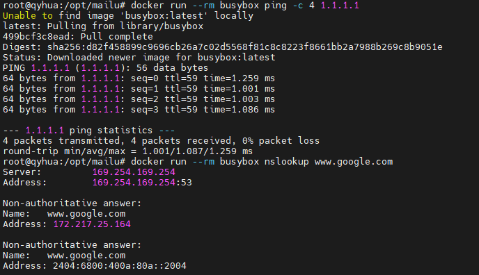
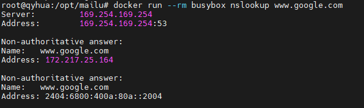
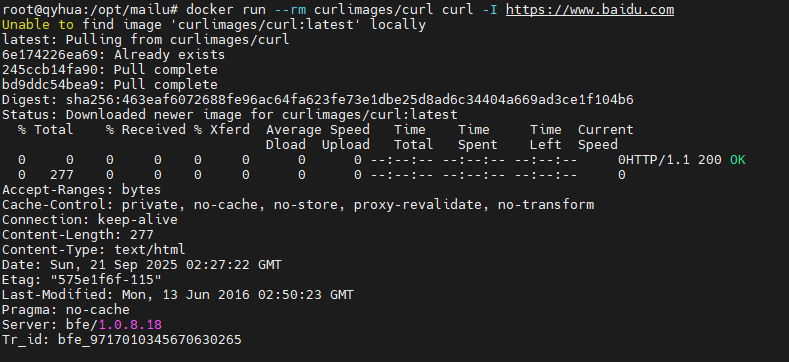
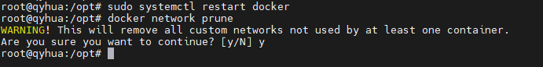

# 一次搞懂 Docker 容器网络：从零验证容器能否正常连通外网

很多同学在使用 Docker 部署服务时，会遇到一个尴尬的问题：**容器里完全没有网络**，无论是 `ping` 还是 `curl` 都失败。  
那么，我们该如何快速验证——到底是服务配置出错，还是 Docker 本身的网络就有问题呢？  

本文将带你从零搭建一个最小化测试环境，逐步确认 **容器能否成功访问外部网络**。

---

## 1 为什么要先验证容器网络？
在复杂的 Docker-Compose 或多容器场景下，服务启动失败、DNS 解析异常、镜像拉取失败……很多问题的根源可能都在于 **容器内没有网络**。  
因此，第一步就是：**抛开业务，直接用最小容器测试网络连通性**。

---

## 2 最小化测试方法

### 2.1 方法一：使用 BusyBox 测试 Ping
`busybox` 是一个超轻量的 Linux 工具箱镜像，只有几 MB，非常适合做基础验证。

#### 2.1.1 运行命令
```bash
docker run --rm busybox ping -c 4 1.1.1.1
````

#### 2.1.2 预期效果

你应该看到类似输出：

```
PING 1.1.1.1 (1.1.1.1): 56 data bytes
64 bytes from 1.1.1.1: seq=0 ttl=59 time=1.259 ms
64 bytes from 1.1.1.1: seq=1 ttl=59 time=1.001 ms
64 bytes from 1.1.1.1: seq=2 ttl=59 time=1.003 ms
64 bytes from 1.1.1.1: seq=3 ttl=59 time=1.086 ms

```



---

### 2.2 方法二：测试 DNS 解析

有时候 **IP 能通，但域名不行**，这通常说明容器内的 DNS 设置有问题。

#### 2.2.1 运行命令

```bash
docker run --rm busybox nslookup www.google.com
```

#### 2.2.2 预期效果

输出应该包含 **DNS 服务器地址** 和 **域名解析后的 IP**。



---

### 2.3 方法三：使用 Curl 验证 TCP 出口

即使能 Ping 通外网，也不代表容器一定能访问 Web 服务，所以我们用 `curl` 验证 TCP 出口。

#### 2.3.1 运行命令

```bash
docker run --rm curlimages/curl curl -I https://www.baidu.com
```

#### 2.3.2 预期效果

输出应包含 `HTTP/1.1 200 OK`，这就说明容器已经能访问外部网站。



---

## 3 常见问题与解决方案

### 3.1 宿主机本身没联网

别忘了：容器网络依赖宿主机。如果宿主机都没网，容器更不可能上网。
👉 先在宿主机执行：

```bash
ping -c 4 1.1.1.1
```

---

### 3.2 Docker 默认 Bridge 网络损坏

有时 Docker 的默认网络（`docker0` 网桥）出问题，可以尝试重启和清理：

```bash
sudo systemctl restart docker
docker network prune
```



---

### 3.3 防火墙或 iptables 规则阻断

Docker 默认依赖 `iptables` 的 `MASQUERADE` 规则来做 NAT。如果被错误清理，就会导致容器出不去。
👉 检查规则：

```bash
sudo iptables -t nat -L -n
```


---

## 4 进阶玩法：自定义最小测试镜像

如果你想完全掌控，可以写一个极简 `Dockerfile` 来测试网络：

#### 4.1 Dockerfile

```dockerfile
FROM busybox
CMD ["ping", "-c", "4", "1.1.1.1"]
```

#### 4.2 构建并运行

```bash
docker build -t net-test .
docker run --rm net-test
```


---

## 5 总结

* **第一步**：用 `busybox ping` 验证 IP 出口
* **第二步**：用 `nslookup` 验证 DNS
* **第三步**：用 `curl` 验证 HTTP 出口
* **遇到问题**：逐步排查宿主机网络、Docker 网络、iptables

只要通过了这三步，你就可以放心——容器的网络环境是健康的，接下来再去排查业务服务本身的配置问题。

---

✨ **小结**：别急着怀疑服务配置，多用最小化容器来确认 Docker 网络。这一步能帮你省下大把排错时间！


