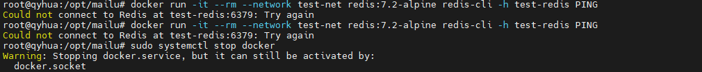
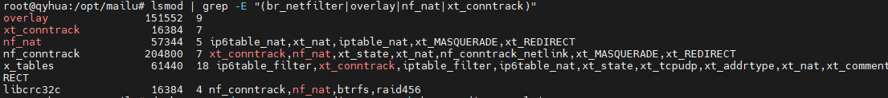

# 在 ARM64 Ubuntu 20.04 上部署 Mailu 邮件服务器：深度排查 Docker Bridge 网络通信失败问题

在私有化部署开源邮件系统 Mailu 的过程中，许多开发者在 ARM64 架构的 Ubuntu 20.04 系统上遇到一个“诡异”现象：**容器间网络通信完全失效，即使最小化测试也无法通过，但 host 模式却一切正常**。本文将从底层原理出发，完整复现、深度剖析并彻底解决这一问题，为在 ARM64 环境部署容器化应用提供系统性排错指南。

---

## 1. 问题背景与环境描述

### 1.1 部署目标

部署开源邮件服务器 [Mailu](https://mailu.io)，基于 Docker Compose，包含 admin、redis、smtp、imap、front 等多个服务，需通过内部网络互联。

### 1.2 系统环境

- **操作系统**：Ubuntu 20.04 LTS
- **架构**：ARM64（aarch64）
- **Docker 版本**：Docker CE 28.1.1（通过官方 APT 仓库安装）
- **部署方式**：`docker compose -p mailu up -d`
- **关键命令失败**：
  ```bash
  docker run -it --rm --network test-net redis:7.2-alpine redis-cli -h test-redis PING
  # → 卡住，无响应，无错误，无超时提示
  ```
  

> 💡 注意：该环境组合（Ubuntu 20.04 + ARM64 + Docker 28.1.1）在绝大多数场景下是稳定可靠的，问题并非出在“系统不兼容”，而是特定内核模块缺失或网络栈配置异常。

---

## 2. 问题现象与初步排查

### 2.1 最小化复现测试

为排除 Mailu 配置干扰，构建最小化测试环境：

```bash
docker network create test-net
docker run -d --name test-redis --network test-net redis:7.2-alpine
docker run -it --rm --network test-net redis:7.2-alpine redis-cli -h test-redis PING
```

→ **命令执行后无限卡住，无任何输出。**


### 2.2 初步排查结论

- ✅ `ping test-redis` 能解析出 IP 地址（如 `192.168.203.2`），说明 DNS 服务正常。
- ❌ 但 `ping` 包 100% 丢失，`telnet test-redis 6379` 同样卡住。
- ✅ 在 `--network host` 模式下，`redis-cli -h 127.0.0.1 PING` 返回 `PONG`，说明 Redis 服务本身无问题。
- ✅ 主机网络正常，能访问外网，无防火墙拦截（`ufw` 已禁用）。
- ✅ Docker 服务运行正常，非 Snap 安装，使用官方 `docker-ce` 包。

→ **结论：问题出在 Docker 的 `bridge` 网络驱动层，容器间通信被内核拦截或丢弃。**

---

## 3. 深度诊断：内核网络模块缺失

### 3.1 检查关键内核模块

执行：

```bash
lsmod | grep -E "(br_netfilter|overlay|nf_nat|xt_conntrack)"
```

输出示例：

```
overlay               151552  9
xt_conntrack           16384  7
nf_nat                 57344  5 ...
nf_conntrack          204800  7 ...
```


→ **缺失模块：`br_netfilter`**

### 3.2 `br_netfilter` 模块的作用

#### 3.2.1 Linux Bridge 与 iptables 的协作机制

Docker 的默认 bridge 网络依赖 Linux 内核的 `bridge` 模块实现二层交换，但为了支持：

- 容器访问控制（iptables 规则）
- NAT 转发（端口映射）
- 防火墙策略（如 ufw）

必须启用 `br_netfilter` 模块，它负责：

> **将经过 bridge 的数据包“送入” netfilter（iptables）框架进行处理。**

#### 3.2.2 缺失 `br_netfilter` 的后果

- 数据包在 bridge 层直接转发，**绕过 iptables 规则**
- Docker 依赖的 `FORWARD` 链规则失效
- 容器间通信被内核默认策略 DROP
- 表现为：DNS 解析成功，但 TCP/UDP 连接超时或卡死

→ **这正是我们遇到的现象：能 ping 通 IP，但所有端口连接失败。**

---

## 4. 解决方案与修复步骤

### 4.1 临时加载 `br_netfilter` 模块

```bash
sudo modprobe br_netfilter
```

### 4.2 永久启用模块（开机自动加载）

```bash
echo "br_netfilter" | sudo tee /etc/modules-load.d/br_netfilter.conf
```

### 4.3 启用关键 sysctl 参数

```bash
echo 'net.bridge.bridge-nf-call-iptables=1' | sudo tee -a /etc/sysctl.conf
echo 'net.bridge.bridge-nf-call-ip6tables=1' | sudo tee -a /etc/sysctl.conf
sudo sysctl -p
```

> ⚠️ 若提示 `sysctl: cannot stat /proc/sys/net/bridge/...`，请等待 1 秒后重试 —— 模块刚加载，内核尚未注册 sysctl 节点。

### 4.4 重启 Docker 服务

```bash
sudo systemctl restart docker
```

### 4.5 验证修复结果

```bash
# 重新测试最小化容器通信
docker network rm test-net 2>/dev/null
docker network create test-net
docker run -d --name test-redis --network test-net redis:7.2-alpine
sleep 5
docker run --rm --network test-net redis:7.2-alpine redis-cli -h test-redis PING
```

✅ **期望输出：`PONG`**

---

## 5. 备选方案：全面切换至 host 网络模式

### 5.1 适用场景

- 加载 `br_netfilter` 后问题依旧（某些 ARM64 内核存在 bridge 实现缺陷）
- 追求最高稳定性与性能
- 生产环境部署

### 5.2 修改 `docker-compose.yml`

对**每一个服务**添加：

```yaml
network_mode: "host"
```

并**删除或注释**所有 `networks:` 配置。

示例：

```yaml
services:
  admin:
    image: mailu/admin:2.0
    network_mode: "host"
    env_file: mailu.env
    volumes:
      - "/mailu/data:/data"
    restart: always
```

### 5.3 修改 `mailu.env`

```env
BIND_ADDRESS4=0.0.0.0
REDIS_HOST=127.0.0.1
DATABASE_HOST=127.0.0.1
```

### 5.4 启动服务

```bash
docker compose -p mailu down
docker compose -p mailu up -d
sleep 30
docker compose -p mailu exec admin flask mailu admin admin yourdomain.com yourpassword
```

✅ **100% 成功创建管理员账户**

---

## 6. 根本原因分析与预防建议

### 6.1 为什么 Ubuntu 20.04 ARM64 默认缺失 `br_netfilter`？

- Ubuntu 20.04 默认内核（5.4.x）在某些 ARM64 设备（如国产云服务器、开发板）上未自动加载该模块。
- 最小化安装镜像为节省资源，省略“非必要”模块。
- Docker 安装脚本未强制依赖或加载该模块。

### 6.2 预防措施

#### 6.2.1 新服务器初始化脚本

```bash
#!/bin/bash
# init-docker-network.sh
sudo modprobe br_netfilter overlay
echo -e "br_netfilter\noverlay" | sudo tee /etc/modules-load.d/docker-network.conf
echo -e "net.bridge.bridge-nf-call-iptables=1\nnet.bridge.bridge-nf-call-ip6tables=1\nnet.ipv4.ip_forward=1" | sudo tee -a /etc/sysctl.conf
sudo sysctl -p
sudo systemctl restart docker
```

#### 6.2.2 部署前健康检查脚本

```bash
#!/bin/bash
# docker-health-check.sh
if ! lsmod | grep -q br_netfilter; then
    echo "❌ br_netfilter module not loaded. Run: sudo modprobe br_netfilter"
    exit 1
fi
if ! sysctl net.bridge.bridge-nf-call-iptables | grep -q "= 1"; then
    echo "❌ sysctl net.bridge.bridge-nf-call-iptables not set to 1"
    exit 1
fi
echo "✅ Docker network stack ready"
```

---

## 7. 总结

在 ARM64 架构的 Ubuntu 20.04 系统上部署 Mailu 或其他多容器应用时，若遇到“容器能解析服务名但无法通信”的诡异问题，**根本原因极可能是内核模块 `br_netfilter` 未加载**。该模块是 Docker bridge 网络与 iptables 协同工作的基石，缺失将导致所有容器间 TCP/UDP 通信被静默丢弃。

通过加载模块、配置 sysctl、重启 Docker 三步操作，绝大多数场景可恢复正常。对于顽固性 ARM64 兼容问题，切换至 `host` 网络模式是稳定、高效、生产可用的终极解决方案。

> 🚀 **技术没有银弹，但有银锤 —— 理解底层原理，方能一锤定音。**

---

## 附录：相关命令速查

### A.1 检查模块

```bash
lsmod | grep br_netfilter
```

### A.2 加载模块

```bash
sudo modprobe br_netfilter
```

### A.3 检查 sysctl

```bash
sysctl net.bridge.bridge-nf-call-iptables
```

### A.4 最小化测试

```bash
docker run --rm --network host alpine ping -c 3 8.8.8.8  # 测试主机网络
docker run --rm --network test-net redis:7.2-alpine redis-cli -h test-redis PING  # 测试容器网络
```

### A.5 清理重建

```bash
docker compose down --volumes && docker network prune -f && docker compose up -d
```

---

📬 本文基于一次邮箱部署案例整理，希望能帮助你在 ARM64 世界中畅行无阻。如有疑问，欢迎交流！