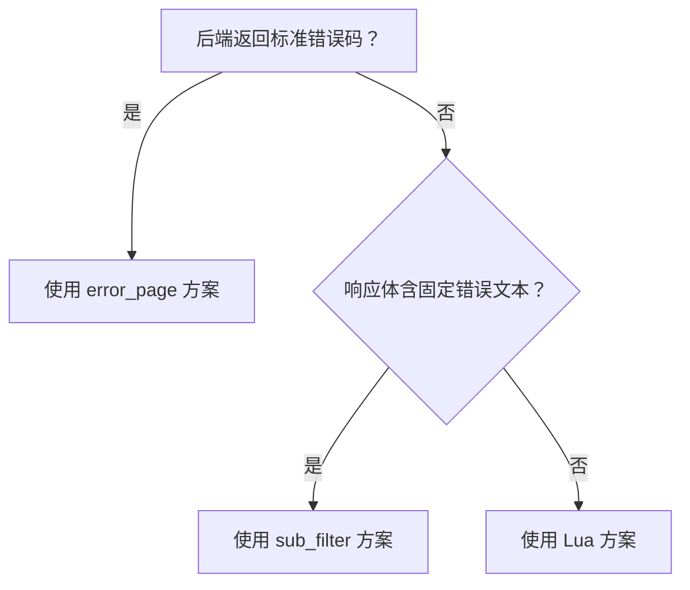

# Nginx黑魔法：无需改代码，巧妙拦截密码错误并重定向到自定义页面

在实际运维和开发中，我们经常会遇到这样的困境：**后端应用已经上线多年，源码无法修改或修改成本极高**，但用户在登录时输入错误密码后，系统却返回一个丑陋、不友好甚至暴露敏感信息的错误页面。作为运维工程师或系统架构师，你是否想过：**能否在不碰一行应用代码的前提下，用 Nginx 实现优雅的错误处理和页面跳转？**

答案是肯定的！本文将深入剖析四种基于 Nginx 的“无侵入式”解决方案，从基础配置到高级技巧，手把手教你如何用 Nginx 的强大能力重塑用户体验。

---

## 1. 问题场景与核心挑战

### 1.1 典型业务痛点

想象这样一个场景：你的公司使用一套老旧的 Java Web 应用，登录接口 `/login` 接收 POST 请求。当用户密码错误时，后端**不会返回标准 HTTP 错误码**（如 401），而是返回 `200 OK`，并在 HTML 页面中嵌入类似“密码错误，请重试”的文本。产品经理要求将此错误页面统一跳转到 `/login?error=1`，但开发团队表示“代码不能动”。

此时，**Nginx 成为你唯一的救星**。

### 1.2 技术挑战分析

要解决这个问题，我们需要克服三个关键障碍：

#### 1.2.1 状态码的不确定性

- 后端可能返回 `200`、`401`、`403`、`422` 等不同状态码
- 无法统一依赖标准错误码进行拦截

#### 1.2.2 响应内容的多样性

- 错误信息可能以 HTML、JSON 或纯文本形式存在
- 错误关键词可能是中文、英文或自定义字符串

#### 1.2.3 POST 请求的特殊性

- HTTP 302 重定向会将 POST 转为 GET，丢失原始表单数据
- 需权衡用户体验与数据完整性

---

## 2. 方案一：基于标准错误码的 error_page 重定向（最推荐）

### 2.1 适用场景

当后端在密码错误时**返回标准 HTTP 错误状态码**（如 401 Unauthorized）时，这是最简洁、高效且符合 HTTP 规范的方案。

### 2.2 配置详解

```nginx
server {
    listen 80;
    server_name your-app.com;
    
    location /login {
        proxy_pass http://backend_app;
        proxy_set_header Host $host;
        proxy_set_header X-Real-IP $remote_addr;
        
        # 拦截指定错误码并重定向
        proxy_intercept_errors on;  # 关键：启用错误拦截
        error_page 401 403 422 =302 /login?error=invalid;
    }
}
```

#### 2.2.1 核心指令解析

- `proxy_intercept_errors on`：**必须开启**，否则 Nginx 会直接透传后端错误页面
- `error_page 401 =302 /path`：将 401 错误**内部重定向**为 302 跳转
- `=302` 中的等号表示**重置响应状态码**为 302

#### 2.2.2 进阶技巧：保留错误上下文

```nginx
# 根据不同错误码跳转到不同页面
error_page 401 =302 /login?error=unauthorized;
error_page 403 =302 /login?error=forbidden;
error_page 422 =302 /login?error=validation;
```

### 2.3 优势与局限

#### 2.3.1 优势

- **性能极高**：无需解析响应体
- **符合规范**：利用标准 HTTP 语义
- **配置简单**：几行代码即可生效

#### 2.3.2 局限

- 依赖后端返回标准错误码
- 无法处理 `200 OK` 中包含错误信息的场景

---

## 3. 方案二：基于响应内容的 sub_filter 动态替换（无状态码依赖）

### 3.1 适用场景

当后端返回 `200 OK`，但在 HTML/JSON 中包含错误关键词（如“密码错误”、“Invalid credentials”）时，此方案大显身手。

### 3.2 配置详解

```nginx
location /login {
    proxy_pass http://backend_app;
    proxy_set_header Host $host;
    
    # 启用响应内容过滤
    sub_filter_once off;      # 全局替换（非首次匹配）
    sub_filter_types *;       # 匹配所有 MIME 类型
    
    # 关键：将错误文本替换为 JavaScript 跳转
    sub_filter '密码错误' '<script>location.href="/login?error=1";</script>';
    sub_filter 'Invalid password' '<script>location.href="/login?error=1";</script>';
}
```

#### 3.2.1 工作原理深度解析

Nginx 的 `sub_filter` 模块会在**响应体发送给客户端前**进行字符串替换。通过注入 `<script>` 标签，强制浏览器跳转到目标页面。

#### 3.2.2 处理 JSON 响应的技巧

如果后端返回 JSON 错误：

```nginx
# 假设返回 {"error": "Invalid credentials"}
sub_filter '"error": "Invalid credentials"' 
           '"redirect": "/login?error=1"';
```

然后在前端 JavaScript 中检测 `redirect` 字段并执行跳转。

### 3.3 注意事项与优化

#### 3.3.1 性能影响

- `sub_filter` 会**缓冲整个响应体**，对大文件不友好
- 建议仅对登录等小流量接口启用

#### 3.3.2 编码问题

确保 Nginx 配置与后端响应编码一致：

```nginx
charset utf-8;  # 在 server 块中声明
```

---

## 4. 方案三：Lua 脚本实现智能响应拦截（高阶玩法）

### 4.1 适用场景

需要**复杂逻辑判断**（如正则匹配、多条件组合）或**动态生成重定向 URL** 时，Lua 方案提供最大灵活性。

### 4.2 环境准备

需安装 [OpenResty](https://openresty.org/) 或编译 Nginx 时加入 `ngx_http_lua_module`。

### 4.3 配置实现

```nginx
location /login {
    proxy_pass http://backend_app;
    proxy_set_header Host $host;
    
    # 捕获响应体并处理
    body_filter_by_lua_block {
        local body = ngx.arg[1]
        if not body then return end
        
        -- 检测多种错误关键词
        if string.find(body, "密码错误") or 
           string.find(body, "Invalid credentials") then
            
            -- 终止当前响应，返回 302
            ngx.status = 302
            ngx.header["Location"] = "/login?error=auth_failed"
            ngx.header["Content-Length"] = nil
            ngx.arg[2] = true  -- 标记响应结束
        end
    }
}
```

#### 4.3.1 Lua 脚本关键点

- `ngx.arg[1]`：当前响应数据块
- `ngx.arg[2] = true`：**立即终止响应流**
- `string.find()`：支持 Lua 模式匹配（类似正则）

#### 4.3.2 高级用法：记录错误日志

```lua
if string.find(body, "密码错误") then
    ngx.log(ngx.WARN, "Auth failed from IP: ", ngx.var.remote_addr)
    -- 执行跳转逻辑...
end
```

### 4.4 方案对比

| 特性 | error_page | sub_filter | Lua |
|------|------------|------------|-----|
| 性能 | ⭐⭐⭐⭐⭐ | ⭐⭐⭐ | ⭐⭐⭐⭐ |
| 灵活性 | ⭐⭐ | ⭐⭐⭐ | ⭐⭐⭐⭐⭐ |
| 复杂度 | ⭐ | ⭐⭐ | ⭐⭐⭐⭐ |
| 适用场景 | 标准错误码 | 固定文本替换 | 动态逻辑 |

---

## 5. 实战建议与最佳实践

### 5.1 诊断先行：确定后端行为

在实施前，务必用 `curl` 或浏览器开发者工具分析后端响应：

```bash
# 模拟错误登录
curl -X POST http://your-app.com/login \
     -d "username=admin&password=wrong" \
     -v  # 查看状态码和响应头
```

### 5.2 方案选择决策树



### 5.3 安全加固

#### 5.3.1 防止开放重定向

确保重定向目标在白名单内：

```nginx
# Lua 示例：验证重定向路径
local allowed_paths = {"/login", "/error"}
local target = "/login?error=1"
if not is_in_table(allowed_paths, target) then
    target = "/login"  # 默认安全路径
end
```

#### 5.3.2 敏感信息过滤

在 `sub_filter` 中清除可能暴露的堆栈信息：

```nginx
sub_filter 'java.lang.Exception' '[REDACTED]';
```

### 5.4 性能监控

在生产环境启用后，监控以下指标：

- Nginx 错误日志中的 `sub_filter` 缓冲区溢出
- Lua 脚本执行时间（通过 `ngx.update_time()` 测量）
- 重定向跳转成功率（通过日志分析）

---

## 6. 结语：Nginx 不只是反向代理

通过本文的四种方案，我们看到 Nginx 远不止是一个简单的反向代理服务器。它是一个**强大的流量操控平台**，能在不修改应用代码的前提下，实现：

- **用户体验优化**：统一错误处理流程
- **安全加固**：过滤敏感信息、防止信息泄露
- **运维灵活性**：快速响应业务需求变更

下次当你面对“不能改代码”的困境时，不妨想想：**也许 Nginx 的配置文件里，就藏着解决问题的魔法**。

> **实践建议**：从 `error_page` 方案开始尝试，逐步进阶到 `sub_filter` 和 Lua。记住，最简单的方案往往是最可靠的方案。