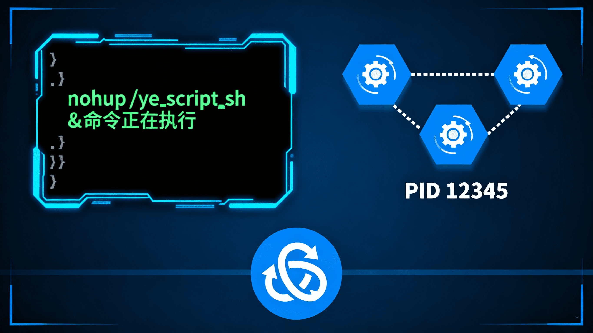

# 让进程永不掉线：Linux nohup命令的深度指南


## 1 引言：为什么你的进程总在退出登录后崩溃？

### 1.1 一个常见的烦恼场景
想象一下这样的场景：你在服务器上启动了一个重要的数据处理任务，这个任务需要运行数小时甚至数天。你小心翼翼地输入命令，看着任务正常启动，然后安心地关闭终端去休息。几个小时后，当你重新登录服务器检查进度时，却发现那个本应正在运行的任务早已终止——一切都要从头开始。

这种令人沮丧的经历，几乎是每个Linux用户的必经之路。

### 1.2 SIGHUP信号的幕后黑手
导致这个问题的元凶是一个名为**SIGHUP**（Signal Hang Up）的系统信号。当用户退出终端会话时，系统会向该终端启动的所有进程发送SIGHUP信号，默认行为就是终止这些进程。

这设计在早期很有意义：当用户拔掉物理终端线（真正的"挂断"）时，清理相关进程。但在现代的多任务服务器环境中，这就成了一个麻烦。

### 1.3 nohup的救赎
`nohup`（No Hang Up）命令正是为解决这个问题而生。它像一个守护盾牌，保护进程免受SIGHUP信号的伤害，让你的任务在用户退出后依然坚挺运行。

## 2 nohup命令的核心机制

### 2.1 语法结构解析
```bash
nohup command [arguments] [&]
```

这个简单的语法背后蕴含着精妙的设计：
- `nohup`：核心命令，创建保护层
- `command`：需要保护的目标程序
- `[arguments]`：传递给程序的参数
- `[&]`：可选的后台运行符号

### 2.2 三重保护机制

#### 2.2.1 信号屏蔽
nohup的核心功能是让被执行的命令对SIGHUP信号"免疫"。它通过修改进程的信号处理表来实现这一点。

#### 2.2.2 输出重定向
为了防止因终端关闭导致的输出错误，nohup会自动处理标准输出和标准错误：
- 标准输出（stdout）默认重定向到 `nohup.out`
- 标准错误（stderr）默认重定向到 `nohup.out`

#### 2.2.3 输入流处理
nohup还会将标准输入（stdin）重定向到 `/dev/null`，避免进程因等待输入而阻塞。

### 2.3 进程关系图解
```
用户终端会话
    |
    +--- nohup进程 (忽略SIGHUP)
          |
          +--- 目标命令进程 (继承信号屏蔽)
```

## 3 实战演练：从入门到精通

### 3.1 基础用法

#### 3.1.1 最简单的后台任务
```bash
# 启动一个长时间运行的任务
nohup ./data_processor.sh &

# 立即返回提示，显示作业号和进程ID
[1] 12345
```
这里的 `12345` 就是进程ID，可用于后续管理。

#### 3.1.2 验证任务状态
```bash
# 检查进程是否在运行
ps aux | grep data_processor

# 查看实时输出
tail -f nohup.out
```

### 3.2 输出重定向的艺术

#### 3.2.1 自定义输出文件
```bash
# 将输出重定向到指定文件
nohup python analysis.py > custom_output.log 2>&1 &
```

**参数解释：**
- `>` ：重定向标准输出
- `2>&1` ：将标准错误重定向到标准输出
- `&` ：后台运行

#### 3.2.2 分离标准输出和错误输出
```bash
# 标准输出和错误输出分开记录
nohup java -jar app.jar > stdout.log 2> stderr.log &
```

这种分离在调试时特别有用，可以快速定位问题类型。

#### 3.2.3 追加模式与覆盖模式
```bash
# 追加到现有文件（推荐用于日志）
nohup command >> output.log 2>&1 &

# 覆盖现有文件
nohup command > output.log 2>&1 &
```

### 3.3 高级配置技巧

#### 3.3.1 静默运行模式
```bash
# 丢弃所有输出（适用于不重要的后台任务）
nohup command > /dev/null 2>&1 &
```

#### 3.3.2 只保留错误日志
```bash
# 正常输出丢弃，只记录错误信息
nohup command > /dev/null 2> error.log &
```

#### 3.3.3 带时间戳的日志
```bash
# 在脚本中实现带时间戳的日志
nohup bash -c 'while true; do echo "$(date): Processing..."; sleep 10; done' > timed_output.log 2>&1 &
```

## 4 真实世界应用场景

### 4.1 数据科学和机器学习

#### 4.1.1 训练机器学习模型
```bash
# 启动一个长时间的训练任务
nohup python train_model.py \
    --epochs 1000 \
    --batch-size 64 \
    --learning-rate 0.001 \
    > training.log 2>&1 &

echo "训练任务已启动，PID: $!"
tail -f training.log
```

#### 4.1.2 大数据处理
```bash
# 处理大型数据集
nohup spark-submit \
    --master yarn \
    --deploy-mode cluster \
    --num-executors 10 \
    big_data_job.py \
    > spark_job.log 2>&1 &
```

### 4.2 Web服务部署

#### 4.2.1 Node.js应用部署
```bash
# 启动Node.js Web服务
nohup node app.js > node_server.log 2>&1 &

# 使用PM2作为更专业的替代方案
nohup pm2 start app.js --name "web-server" > pm2.log 2>&1 &
```

#### 4.2.2 Python Web应用
```bash
# 启动Django/Flask应用
nohup gunicorn -w 4 -b 0.0.0.0:8000 app:app > gunicorn.log 2>&1 &
```

### 4.3 系统维护任务

#### 4.3.1 定期备份任务
```bash
# 启动数据库备份
nohup mysqldump -u user -p database > backup.sql 2> backup_error.log &

# 文件系统备份
nohup rsync -av /source/ /backup/ > rsync.log 2>&1 &
```

#### 4.3.2 监控和告警脚本
```bash
# 启动系统监控脚本
nohup bash system_monitor.sh > monitor.log 2>&1 &
```

## 5 进程管理与监控

### 5.1 查看nohup进程

#### 5.1.1 使用ps命令
```bash
# 查看所有nohup启动的进程
ps aux | grep nohup

# 查看特定用户的进程
ps -u username -o pid,cmd | grep nohup
```

#### 5.1.2 使用jobs命令
```bash
# 查看当前会话的后台作业
jobs -l

# 显示作业号和进程ID
[1]  + 12345 running    nohup python script.py
```

### 5.2 进程生命周期管理

#### 5.2.1 优雅终止进程
```bash
# 找到进程ID
ps aux | grep "python script.py"

# 发送终止信号
kill 12345

# 强制杀死（不推荐）
kill -9 12345
```

#### 5.2.2 进程状态监控
```bash
# 实时监控资源使用情况
top -p 12345

# 查看进程的详细状态
cat /proc/12345/status

# 监控日志文件变化
tail -f nohup.out
```

### 5.3 自动化管理脚本

#### 5.3.1 启动监控脚本
```bash
#!/bin/bash
# start_service.sh

SCRIPT_NAME="service.py"
LOG_FILE="service_$(date +%Y%m%d_%H%M%S).log"
PID_FILE="service.pid"

echo "启动服务: $SCRIPT_NAME"
nohup python $SCRIPT_NAME > $LOG_FILE 2>&1 &
PID=$!

echo $PID > $PID_FILE
echo "服务已启动，PID: $PID, 日志文件: $LOG_FILE"
```

#### 5.3.2 停止服务脚本
```bash
#!/bin/bash
# stop_service.sh

PID_FILE="service.pid"

if [ -f $PID_FILE ]; then
    PID=$(cat $PID_FILE)
    echo "停止服务，PID: $PID"
    kill $PID
    rm $PID_FILE
    echo "服务已停止"
else
    echo "PID文件不存在，服务可能未运行"
fi
```

## 6 超越nohup：更强大的替代方案

### 6.1 screen：会话管理专家

#### 6.1.1 screen基础使用
```bash
# 创建新会话
screen -S long_task

# 在会话中运行任务
python long_running_script.py

# 分离会话（任务继续运行）
Ctrl + A, D

# 重新连接会话
screen -r long_task
```

#### 6.1.2 screen的优势
- 可以重新连接并进行交互
- 支持多个虚拟终端
- 会话持久化

### 6.2 tmux：终端复用器的现代选择

#### 6.2.1 tmux基础操作
```bash
# 启动新会话
tmux new-session -s my_session

# 运行任务
./start_service.sh

# 分离会话
Ctrl + B, D

# 重新连接
tmux attach-session -t my_session
```

#### 6.2.2 tmux的高级特性
```bash
# 创建带名称的窗口
tmux new-window -n 'service'

# 分割窗格
tmux split-window -h

# 窗格间切换
tmux select-pane -L
```

### 6.3 systemd：生产级服务管理

#### 6.3.1 创建systemd服务文件
```ini
# /etc/systemd/system/my-service.service
[Unit]
Description=My Long Running Service
After=network.target

[Service]
Type=simple
User=myuser
WorkingDirectory=/home/myuser/app
ExecStart=/usr/bin/python /home/myuser/app/service.py
Restart=always
StandardOutput=journal
StandardError=journal

[Install]
WantedBy=multi-user.target
```

#### 6.3.2 管理systemd服务
```bash
# 启用并启动服务
sudo systemctl enable my-service
sudo systemctl start my-service

# 查看服务状态
sudo systemctl status my-service

# 查看服务日志
sudo journalctl -u my-service -f
```

## 7 最佳实践与常见陷阱

### 7.1 必须遵循的最佳实践

#### 7.1.1 日志管理策略
```bash
# 使用日志轮转防止磁盘爆满
nohup command > /var/log/myapp/$(date +%Y%m%d).log 2>&1 &

# 或者使用logrotate工具
# /etc/logrotate.d/myapp
/var/log/myapp/*.log {
    daily
    rotate 7
    compress
    missingok
    notifempty
}
```

#### 7.1.2 工作目录设置
```bash
# 明确设置工作目录
cd /path/to/project && nohup ./start.sh > output.log 2>&1 &
```

#### 7.1.3 环境变量处理
```bash
# 确保环境变量正确设置
nohup env DISPLAY=:0 java -jar app.jar > app.log 2>&1 &
```

### 7.2 需要避免的常见错误

#### 7.2.1 权限问题
```bash
# 错误：没有写入权限
nohup command > /root/output.log 2>&1 &  # 可能失败

# 正确：使用有权限的目录
nohup command > /tmp/output.log 2>&1 &
```

#### 7.2.2 资源泄漏
```bash
# 监控资源使用
nohup ./memory_intensive_task.sh > output.log 2>&1 &

# 定期检查内存使用
watch -n 60 'ps aux | grep memory_intensive_task'
```

#### 7.2.3 信号处理不当
```bash
# 在脚本中正确处理信号
#!/bin/bash
cleanup() {
    echo "收到终止信号，正在清理..."
    # 清理资源
    exit 0
}

trap cleanup SIGTERM SIGINT

# 主程序逻辑
while true; do
    process_data
    sleep 10
done
```

## 8 总结与选择指南

### 8.1 工具选择矩阵

| 使用场景 | 推荐工具 | 理由 |
|---------|----------|------|
| 快速临时任务 | `nohup` | 简单直接，无需配置 |
| 需要交互的长时间任务 | `screen`/`tmux` | 可重新连接，支持交互 |
| 生产环境服务 | `systemd` | 完整的服务管理，自动重启 |
| 开发环境 | `docker-compose` | 环境隔离，易于部署 |


### 8.2 最后的建议

**记住nohup的定位**：它是一个简单有效的工具，适合临时性、非关键的任务。对于重要的生产服务，建议使用更专业的进程管理工具。

nohup就像是一把瑞士军刀——在某些情况下非常有用，但面对复杂任务时，你可能需要更专业的工具。掌握它，但也要知道何时该使用更强大的替代方案。

现在，去让你的进程永远在线吧！
