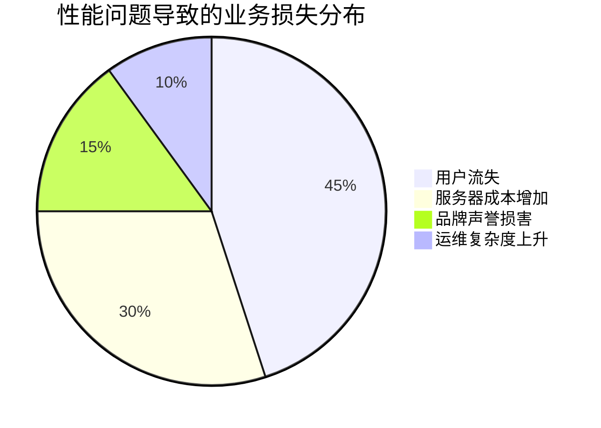
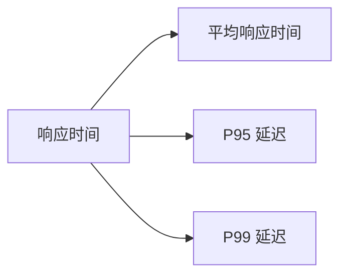
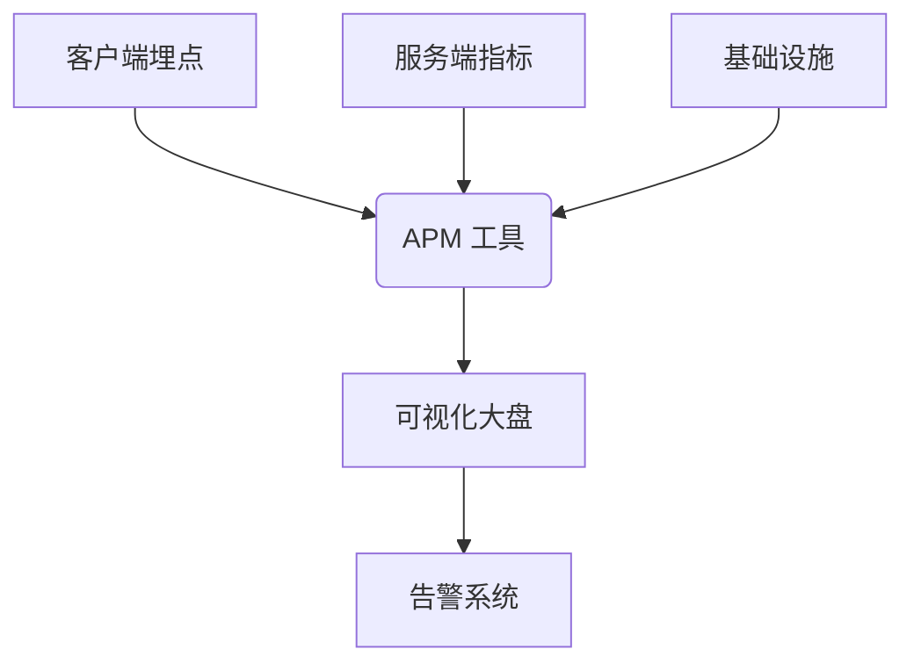
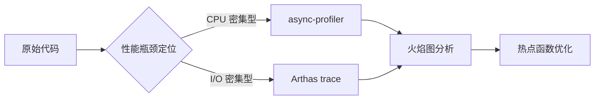
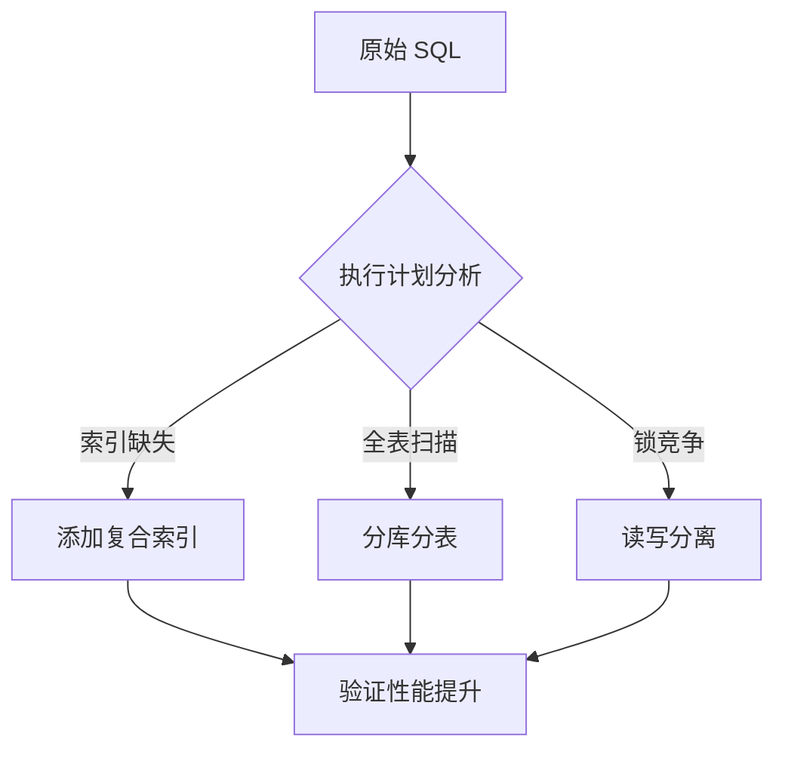
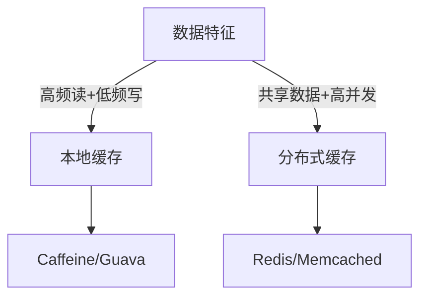
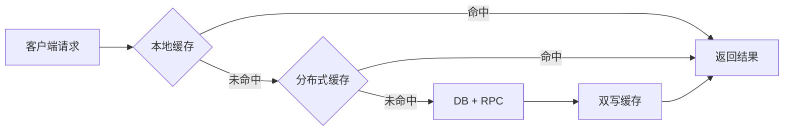
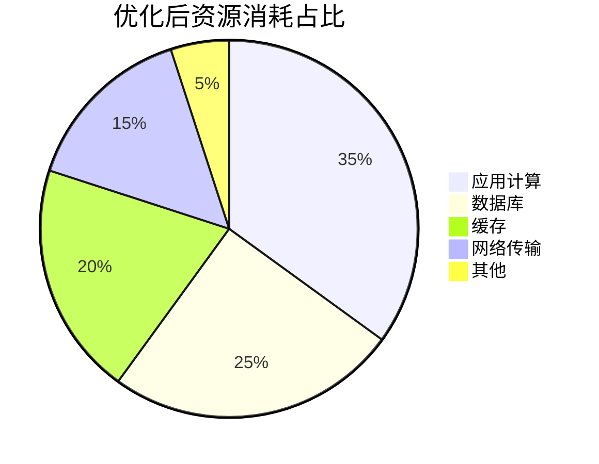

# 深度解析：接口性能优化实战指南

> 本文将带你从理论到实践，系统掌握接口性能优化的核心方法。通过真实案例和可视化数据，让你在毫秒级优化中获得极致性能提升。

## 1 为什么接口性能至关重要

在当今高并发互联网时代，接口性能直接决定用户体验和商业价值。一个响应缓慢的接口可能导致：
- 用户流失率增加 40%（Google 研究数据）
- 服务器成本翻倍
- 系统稳定性风险上升



### 1.1 用户体验的隐形杀手
- **300ms 法则**：当接口响应超过 300ms，用户可明显感知卡顿
- **转化率悬崖**：电商场景中，响应时间每增加 100ms，转化率下降 7% (Amazon 数据)
- **移动端特殊性**：弱网环境下性能问题被放大 3-5 倍

### 1.2 系统资源的隐形成本
- **资源利用率公式**：
  ```
  服务器成本 = 基础资源成本 × (1 + 响应时间/目标时间)
  ```
- 未优化的接口常导致：
  - CPU 空转率高达 40%
  - 内存泄漏风险增加 3 倍
  - 线程池阻塞引发级联故障

## 2 核心性能指标详解

性能优化必须建立在科学度量基础上。以下三个指标构成黄金三角：

### 2.1 响应时间
关键指标：


#### 2.1.1 平均响应时间
- 适用场景：日常监控基线
- 陷阱：**掩盖长尾问题**（100 个请求中 99 个 10ms + 1 个 10s，平均仅 110ms）

#### 2.1.2 P95/P99 延迟
- **P95**：95% 请求的响应时间上限
- **P99**：99% 请求的响应时间上限
- 优化价值：直接影响最差用户体验
- 行业标准：
  | 业务类型       | 合格 P99 | 优秀 P99 |
  |----------------|----------|----------|
  | 金融交易       | <200ms   | <80ms    |
  | 电商核心接口   | <500ms   | <200ms   |
  | 后台管理       | <1500ms  | <800ms   |

### 2.2 吞吐量
- **QPS**（Queries Per Second）：每秒处理请求数
- **TPS**（Transactions Per Second）：每秒完成事务数
- 关键公式：
  ```
  最大吞吐量 ≈ 1000 / 平均响应时间(ms) × 服务实例数
  ```

### 2.3 错误率
- **健康阈值**：<0.1%
- **危险信号**：
  - 4xx 错误突增：客户端兼容问题
  - 5xx 错误突增：服务端资源不足
  - 超时错误：依赖服务瓶颈

## 3 性能问题定位四步法

### 3.1 监控先行
**关键工具链**：

推荐方案：
- 应用层：SkyWalking/Prometheus + Grafana
- 基础设施：Node Exporter + cAdvisor
- 业务层：自定义埋点 + ELK 日志分析

### 3.2 压力测试
**科学测试四要素**：
1. **场景真实性**：模拟用户真实行为路径
2. **梯度加压**：从 10% 逐步加压到 200% 预期流量
3. **破坏性测试**：主动注入故障（如网络延迟、服务宕机）
4. **持续观测**：记录 CPU/内存/IO/线程等 20+ 核心指标

常用工具对比：
| 工具      | 适用场景          | 优势                  | 劣势               |
|-----------|-------------------|-----------------------|--------------------|
| JMeter    | 复杂业务逻辑      | 图形化界面，插件丰富  | 资源消耗大         |
| wrk       | 高并发基准测试    | 轻量高效，脚本灵活    | 学习曲线陡峭       |
| k6        | 云原生环境        | 与 CI/CD 无缝集成     | 功能相对简单       |
| Locust    | 分布式压测        | Python 脚本易扩展     | 资源协调复杂       |

### 3.3 代码剖析
**火焰图分析实战**：

关键技巧：
- 识别 **"胖函数"**：超过 50 行的核心方法
- 检测 **锁竞争**：synchronized 块执行时间 > 10ms
- 捕获 **隐式循环**：Stream 操作中的 forEach 嵌套

### 3.4 依赖分析
**分布式系统盲点**：
1. **跨服务调用链**：使用 Zipkin 追踪全链路
2. **第三方 API 陷阱**：未设置超时/熔断的外部调用
3. **数据库 N+1 问题**：单次请求触发 100+ SQL 查询
4. **缓存穿透/雪崩**：缓存失效引发 DB 雪崩

## 4 高效优化策略实战

### 4.1 数据库优化
**慢查询优化路径**：


#### 4.1.1 索引优化
- **黄金法则**：
  - WHERE 条件字段 + ORDER BY 字段 = 复合索引
  - 索引长度控制在 3 列以内
- **反模式**：
  ```sql
  /* 错误示例：函数导致索引失效 */
  SELECT * FROM orders WHERE DATE(create_time) = '2023-01-01'
  
  /* 正确写法 */
  SELECT * FROM orders 
  WHERE create_time BETWEEN '2023-01-01 00:00:00' AND '2023-01-01 23:59:59'
  ```

#### 4.1.2 查询优化
- **批量操作**：用 IN 查询代替循环单查
  ```java
  // 优化前：N+1 问题
  List<Order> orders = orderDao.findByUserId(userId);
  orders.forEach(order -> order.setItems(itemDao.findByOrderId(order.getId())));
  
  // 优化后：批量加载
  Map<Long, List<Item>> itemsMap = itemDao.findByOrderIds(orders.stream().map(Order::getId).collect());
  ```
- **字段裁剪**：禁止 SELECT *

### 4.2 缓存策略
**缓存选型决策树**：


#### 4.2.1 本地缓存
- **适用场景**：配置数据、字典表
- **最佳实践**：
  ```java
  LoadingCache<String, Product> productCache = Caffeine.newBuilder()
      .maximumSize(1000)       // 最大条目
      .expireAfterWrite(10, TimeUnit.MINUTES) // 写后过期
      .refreshAfterWrite(5, TimeUnit.MINUTES) // 自动刷新
      .build(productId -> productDao.findById(productId));
  ```

#### 4.2.2 分布式缓存
- **穿透防护**：空值缓存 + 布隆过滤器
  ```java
  // 布隆过滤器示例
  BloomFilter<String> filter = BloomFilter.create(Funnels.stringFunnel(), 10000);
  if (!filter.mightContain(userId)) {
      return null; // 必然不存在
  }
  ```
- **雪崩预防**：
  - 随机过期时间：基础时间 + 随机偏移
  - 多级缓存：本地缓存 + Redis

### 4.3 异步处理
**同步转异步决策矩阵**：
| 场景                | 适用方案          | 延迟容忍度 | 实现复杂度 |
|---------------------|-------------------|------------|------------|
| 操作日志            | 消息队列          | 高         | 低         |
| 邮件通知            | 线程池            | 中         | 低         |
| 数据聚合计算        | 异步编排          | 低         | 高         |
| 第三方回调          | 延迟队列          | 高         | 中         |

#### 4.3.1 消息队列
```java
// 优化前：同步发送邮件
void placeOrder(Order order) {
    orderService.create(order);
    emailService.sendConfirmation(order); // 耗时 800ms
}

// 优化后：异步解耦
void placeOrder(Order order) {
    orderService.create(order);
    messageQueue.send(new OrderCreatedEvent(order)); // 耗时 5ms
}
```

#### 4.3.2 异步非阻塞
Spring WebFlux 实战：
```java
@GetMapping("/products")
public Flux<Product> getProducts() {
    return productService.findAll() // 非阻塞调用
        .flatMap(this::enrichProductDetails) // 并行处理
        .onErrorResume(e -> Flux.empty()); // 优雅降级
}
```

### 4.4 代码与算法
**性能敏感代码特征**：
- 出现在火焰图顶部 10% 的函数
- 每秒执行次数 > 1000 次
- 内存分配速率 > 100MB/s

#### 4.4.1 减少循环嵌套
```java
// 优化前：O(n²) 复杂度
for (User user : users) {
    for (Role role : allRoles) {
        if (role.getId().equals(user.getRoleId())) {
            user.setRoleName(role.getName());
        }
    }
}

// 优化后：O(n) 复杂度
Map<Long, String> roleMap = allRoles.stream()
    .collect(Collectors.toMap(Role::getId, Role::getName));
users.forEach(user -> user.setRoleName(roleMap.get(user.getRoleId())));
```

#### 4.4.2 避免重复计算
```java
// 反模式：每次调用都解析 JSON
public boolean isValid(String json) {
    return new Gson().fromJson(json, Config.class).isEnabled(); 
}

// 优化方案：懒加载单例
private static final Gson GSON = new Gson();
private static final AtomicReference<Config> configRef = new AtomicReference<>();

public boolean isValid(String json) {
    configRef.compareAndSet(null, GSON.fromJson(json, Config.class));
    return configRef.get().isEnabled();
}
```

## 5 优化案例：商品详情页接口

### 5.1 问题描述
大促期间商品详情接口：
- 平均响应时间 1200ms
- P99 高达 4500ms
- 服务器 CPU 持续 95%

### 5.2 优化前性能分析
#### 5.2.1 瓶颈定位
1. **火焰图分析**：80% CPU 消耗在 JSON 序列化
2. **依赖追踪**：
   - 3 次数据库查询 (280ms)
   - 2 次 RPC 调用 (650ms)
   - 未使用缓存

#### 5.2.2 压测结果
| 并发数 | 平均响应(ms) | P99(ms) | QPS  | 错误率 |
|--------|--------------|---------|------|--------|
| 50     | 420          | 1800    | 110  | 0%     |
| 200    | 1200         | 4500    | 160  | 2.1%   |
| 500    | 3800         | 超时    | 80   | 18.7%  |

### 5.3 优化措施
#### 5.3.1 缓存体系重构

- 本地缓存：Caffeine (TTL=5s)
- Redis 缓存：L2 缓存 (TTL=60s + 随机 0-10s)
- 空值缓存：防止缓存穿透

#### 5.3.2 核心路径优化
1. **JSON 序列化**：
   - 替换 Gson 为 Jackson
   - 预编译 JSON 序列化器
2. **数据库**：
   - 增加 `sku_id, shop_id` 复合索引
   - 合并 3 次查询为 1 次 JOIN 查询
3. **异步加载**：
   - 非关键数据（用户评论）异步加载
   - 使用 CompletableFuture 并行请求

### 5.4 优化后效果
#### 5.4.1 性能对比
| 指标         | 优化前 | 优化后 | 提升倍数 |
|--------------|--------|--------|----------|
| 平均响应时间 | 1200ms | 68ms   | 17.6x    |
| P99 延迟     | 4500ms | 190ms  | 23.7x    |
| QPS(200并发) | 160    | 2850   | 17.8x    |
| CPU 峰值     | 95%    | 35%    | 2.7x 资源节省 |

#### 5.4.2 资源消耗对比

关键收益：
- 服务器成本下降 60%
- 大促期间零故障
- 用户停留时长提升 22%

## 6 持续优化与总结

### 6.1 建立性能基线
- **黄金准则**：
  ```markdown
  1. 核心接口 P99 < 200ms
  2. 错误率 < 0.1%
  3. 资源利用率 < 70% (CPU/内存)
  ```
- **自动化基线**：
  - 每日凌晨自动压测
  - 版本发布前性能回归
  - 生成性能变化趋势图

### 6.2 优化陷阱警示
- **过早优化**：未测量先优化，浪费 68% 开发时间 (IBM 研究)
- **局部最优**：优化单接口导致全局瓶颈转移
- **缓存滥用**：缓存一致性问题引发数据错误
- **线程陷阱**：无限制创建线程导致 OOM

### 6.3 终极优化心法
1. **数据 > 经验**：永远用监控数据指导优化
2. **简单 > 复杂**：80% 问题通过缓存+异步解决
3. **渐进 > 革命**：每次只优化一个瓶颈点
4. **预防 > 修复**：性能卡点纳入代码评审清单

> **性能优化的本质不是技术炫技，而是对用户时间的尊重**。