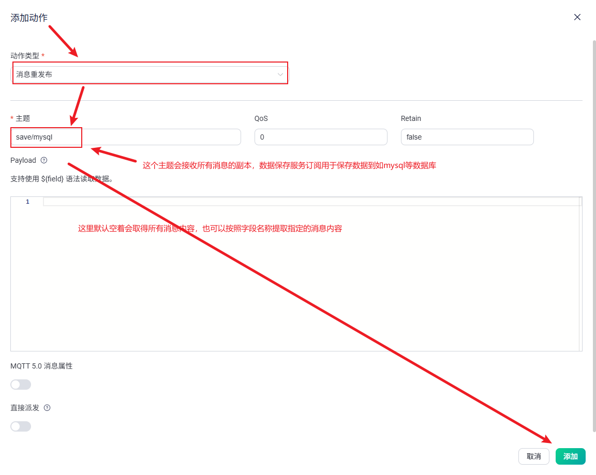

# 使用 EMQX 社区版 v5.8.7 将 MQTT 消息持久化到 MySQL 数据库的实践指南

> **摘要**：本文详细介绍了如何在 EMQX 社区版 v5.8.7 中，通过规则引擎将 MQTT 消息持久化到本地 MySQL 数据库，解决社区版缺乏消息历史查询能力的问题，为中小团队和创业公司提供一种低成本、高可控性的数据落地方案。

---

## 1. 为什么选择 EMQX 社区版 v5.8.7？

### 1.1 成本与可控性的权衡

在物联网（IoT）项目初期，消息中间件的选择往往面临“功能”与“成本”的双重考量。EMQX 作为业界领先的开源 MQTT 消息服务器，提供了多个版本：

| 版本类型       | 费用情况              | 同时在线连接上限 | 消息历史查询 | 适用场景               |
|----------------|-----------------------|------------------|--------------|------------------------|
| **EMQX Cloud 免费版** | 免费                  | ≤ 1000           | ✅（有限）    | 原型验证、小型测试     |
| **EMQX 企业版**     | ¥935 / 月起           | 无硬性限制       | ✅            | 中大型生产环境         |
| **EMQX 社区版 v5.8.7** | **完全免费、开源**     | **无硬性限制**   | ❌            | **自建服务器、成本敏感型项目** |

> 💡 对于创业公司或预算有限的团队，EMQX 社区版 v5.8.7 成为极具吸引力的选择——不仅完全免费，还能部署在自有服务器上，数据主权完全掌握在自己手中，避免了云服务潜在的数据合规与安全风险。

### 1.2 社区版的局限与痛点

尽管 EMQX 社区版在连接能力上表现优异，生产与消费消息稳定可靠，但在实际运维中我们发现一个关键短板：

> **无法查看历史消息的 payload 内容**。

这意味着一旦设备上报异常，运维人员无法回溯原始报文进行分析，极大增加了故障排查难度。而企业版提供的“消息追踪”与“历史消息查询”功能恰好能解决这一问题，但其订阅费用对初创团队仍显高昂。

### 1.3 曾尝试的解决方案及其挑战

为弥补这一缺陷，我们曾探索多种方案：

#### 1.3.1 使用官方 MySQL 插件

早期 EMQX 提供过 `emqx_mysql` 插件，但该插件在 v5.x 架构中已被废弃。尝试在 v5.8.7 中强行集成时，遭遇以下问题：

- 插件与当前版本 Erlang/OTP 不兼容；
- 编译依赖复杂，文档缺失；
- 社区支持有限，问题难以定位。

#### 1.3.2 修改 EMQX 源码

考虑到 EMQX 使用 Erlang（ERL）语言开发，我们评估过自行扩展写入 MySQL 的逻辑。但团队缺乏 Erlang 开发经验，学习成本高、周期长，短期内难以落地。

#### 1.3.3 转向规则引擎：轻量级破局之道

最终，我们发现 EMQX v5.x 引入的**规则引擎（Rule Engine）** 提供了更灵活、低侵入的解决方案。虽然社区版不支持直接写入数据库的动作（Action），但可通过“**消息重发布（Republish）**”将原始消息转发至特定主题，再由外部服务（如自研消费者）订阅该主题并写入 MySQL。

> ✅ 这一方案无需修改 EMQX 核心，部署简单，且完全兼容社区版。

---

## 2. 基于规则引擎的消息重发布方案设计

### 2.1 整体架构流程


> **说明**：所有设备发布的消息（无论主题）均被规则捕获，并重发布到 `persist/topic`。外部消费者订阅该主题，负责解析 JSON/二进制 payload 并持久化到 MySQL。

### 2.2 为什么选择“重发布”而非直接写库？

EMQX 社区版 v5.8.7 的规则引擎**不支持原生 MySQL 写入动作**，但支持以下动作类型：

- 消息重发布（Republish）
- Webhook
- 桥接 Kafka/Pulsar 等

其中，“重发布”最轻量、延迟最低，且无需网络外联，适合内网部署场景。

---

## 3. EMQX 社区版 v5.8.7 规则配置实操

### 3.1 登录 EMQX Dashboard

确保已成功部署 EMQX v5.8.7，并可通过浏览器访问 Dashboard（默认地址：`http://<your-emqx-ip>:18083`）。

### 3.2 创建消息持久化规则

#### 3.2.1 进入规则引擎界面

1. 在左侧导航栏点击 **集成（Integration）**；
2. 选择 **规则（Rules）** 选项卡；
3. 点击右上角 **创建（Create）** 按钮。

> 📌 **EMQX Dashboard 规则引擎入口界面**  
> 

#### 3.2.2 编写 SQL 规则

在 **SQL 编辑器** 中输入以下语句：

```sql
SELECT * FROM "#"
```

> **解释**：
> - `#` 是 MQTT 通配符，表示匹配**所有主题**；
> - `SELECT *` 表示保留原始消息的所有字段（包括 `payload`, `topic`, `qos`, `timestamp` 等）。


#### 3.2.3 添加“消息重发布”动作

1. 在界面右侧 **动作** 区域，点击 **添加**；
2. **动作类型** 选择：**消息重发布**；
3. **目标主题** 输入自定义主题，例如：`save/mysql`；
4. （可选）可设置 QoS、保留消息等参数；
5. 点击 **添加** 按钮确认。

> 📌 **插图位置：添加 Republish 动作配置界面**  
> 

#### 3.2.4 保存规则

- 为规则命名，例如：`Persist_All_Messages_To_MySQL`；
- 点击 **创建（Create）** 完成配置。

> ✅ 此时，所有进入 EMQX 的消息副本都会被自动转发到 `save/mysql` 主题（不影响原有消费）。

---

## 4. 外部消费者服务开发建议

### 4.1 服务职责

该服务需实现以下功能：

1. 使用 MQTT 客户端（如 Paho）订阅 `persist/all_messages`；
2. 接收消息后解析 `payload`（支持 JSON、Protobuf、自定义二进制等）；
3. 提取关键字段（如设备 ID、时间戳、传感器值）；
4. 写入 MySQL 表，建议表结构如下：

```sql
CREATE TABLE mqtt_messages_log (
    id BIGINT AUTO_INCREMENT PRIMARY KEY,
    topic VARCHAR(255) NOT NULL,
    payload TEXT,
    qos TINYINT,
    timestamp_ms BIGINT,
    received_at TIMESTAMP DEFAULT CURRENT_TIMESTAMP,
    device_id VARCHAR(100),
    -- 可根据业务扩展字段
    INDEX idx_device (device_id),
    INDEX idx_received (received_at)
);
```


### 4.2 高可用与性能优化

- 使用连接池管理 MySQL 写入；
- 批量插入（如每 100 条或每秒 flush 一次）；
- 消息去重（基于 `message_id` 或业务唯一键）；
- 监控消费者延迟（如 Lag 监控）。


---

## 5. 总结与展望

### 5.1 方案优势

- **零成本**：完全基于 EMQX 社区版，无额外授权费用；
- **高可控**：数据落库逻辑由自研服务控制，可灵活适配业务；
- **低侵入**：不修改 EMQX 核心，升级维护无风险；
- **可扩展**：未来可轻松替换为 Kafka、ClickHouse 等存储。

### 5.2 后续优化方向

- 增加消息过滤规则（如仅持久化 `sensors/+` 主题）；
- 在消费者中集成数据清洗与告警逻辑；
- 结合 Grafana 实现消息历史可视化。

> **结语**：虽然 EMQX 社区版在功能上有所取舍，但通过规则引擎 + 外部服务的组合，我们依然能构建出满足生产需求的消息持久化体系。这不仅是技术上的 workaround，更是对“开源 + 自主可控”理念的最佳实践。

--- 

> **附录**：  
> - EMQX 官方文档：https://www.emqx.io/docs  
> - EMQX GitHub：https://github.com/emqx/emqx  
> - 示例 消息副本代码java实现保存mysql GitHub：https://github.com/qyhua0/mq_log 。