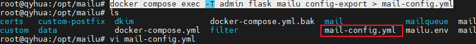

# Mailu 命令行工具完整使用教程

## 1. 概述

> 📌 **温馨提示**：本文档基于 master 分支编写。稳定版 2024.06 的文档。

Mailu 提供了一套强大的命令行工具，让管理员能够轻松管理域名、用户和别名。通过 Docker Compose 执行这些命令，您可以高效地完成日常运维工作。

## 2. 基本管理命令

### 2.1 user - 创建用户
**功能**：创建新的邮件用户。

```bash
docker compose exec admin flask mailu user myuser example.net 'password123'
```

### 2.2 alias-delete - 删除别名
**功能**：删除指定的邮件别名。

```bash
docker compose exec admin flask mailu alias-delete foo@example.net
```

### 2.3 domain - 管理域名
**功能**：添加或管理邮件域名。

```bash
docker compose exec admin flask mailu domain example.net
```

### 2.4 password - 修改用户密码
**功能**：修改指定用户的密码。

```bash
docker compose exec admin flask mailu password myuser example.net 'password123'
```


### 2.5 user-import - 导入用户（哈希密码）
**特点**：与简单user命令的主要区别是直接导入密码哈希值——这在从其他系统迁移用户时非常有用，特别是当只知道哈希值的情况下。

```bash
docker compose run --rm admin flask mailu user-import myuser example.net '$6$51ebe0cb9f1dab48effa2a0ad8660cb489b445936b9ffd812a0b8f46bca66dd549fea530ce' 'SHA512-CRYPT'
```

### 2.6 user-delete - 删除用户
**重要说明**：虽然动作名为"user-delete"，但默认情况下用户只是被停用。这是因为Mailu在删除用户时不会移除用户数据（邮件和网页邮件联系人）。添加 `-r` 参数可在手动删除用户数据后真正删除用户。

```bash
docker compose exec admin flask mailu user-delete foo@example.net
```

## 3. 高级配置管理

### 3.1 config-update - 批量配置更新
**主要用途**：批量导入用户/别名，并与外部YAML模板同步数据库条目。

#### 3.1.1 基本用法
```bash
cat mail-config.yml | docker compose exec -T admin flask mailu config-update --delete-objects
```

#### 3.1.2 YAML配置文件示例
```yaml
users:
  - localpart: foo
    domain: example.com
    password_hash: klkjhumnzxcjkajahsdqweqqwr

aliases:
  - localpart: alias1
    domain: example.com
    destination: "user1@example.com,user2@example.com"
```

#### 3.1.3 删除选项说明
不使用 `--delete-objects` 选项时，config-update 只会添加/更新新值，不会删除在提供的YAML输入中缺失的条目。

### 3.2 config-export - 配置导出
**功能**：以YAML或JSON格式导出完整配置。

#### 3.2.1 帮助信息查看
```bash
docker compose exec -T admin flask mailu config-export --help
```

输出结果：
```
Usage: flask mailu config-export [OPTIONS] [FILTER]...

  将配置以YAML或JSON格式导出到标准输出或文件

选项：
  -f, --full                  包含具有默认值的属性。
  -s, --secrets               包含秘密属性（dkim密钥、密码）。
  -d, --dns                   包含DNS记录。
  -c, --color                 强制彩色输出。
  -o, --output-file FILENAME  将配置保存到文件。
  -j, --json                  以json格式导出配置。
  -?, -h, --help              显示此帮助信息。
```

#### 3.2.2 使用示例
```bash
# 导出到文件(导出到容器)
docker compose exec admin flask mailu config-export --output-file mail-config.yml

# 导出到文件（导出到宿主机）
docker compose exec -T admin flask mailu config-export > mail-config.yml

```



#### 3.2.3 选项说明
- 默认只导出非默认属性，使用 `--full` 导出所有属性
- 使用 `--secrets` 导出明文密钥（dkim密钥、密码）
- 使用 `--dns` 包含DNS记录（mx、spf、dkim和dmarc）

### 3.3 config-import - 配置导入
**功能**：从外部YAML或JSON源导入配置数据。

#### 3.3.1 帮助信息查看
```bash
docker compose exec -T admin flask mailu config-import --help
```

输出结果：
```
Usage: flask mailu config-import [OPTIONS] [FILENAME|-]

  从标准输入或文件导入YAML或JSON配置

选项：
  -v, --verbose   增加详细程度。
  -s, --secrets   在消息中显示秘密属性。
  -q, --quiet     安静模式 - 只显示错误。
  -c, --color     强制彩色输出。
  -u, --update    更新模式 - 将输入与现有配置合并。
  -n, --dry-run   试运行，不进行实际更改。
  -?, -h, --help  显示此帮助信息。
```

#### 3.3.2 标准输入导入
```bash
docker compose exec -T admin flask mailu config-import -nv < mail-config.yml
```

#### 3.3.3 YAML配置文件示例
```yaml
domain:
  - name: example.com
    alternatives:
      - alternative.example.com

user:
  - email: foo@example.com
    password_hash: '$2b$12$...'
    hash_scheme: MD5-CRYPT

alias:
  - email: alias1@example.com
    destination:
      - user1@example.com
      - user2@example.com

relay:
  - name: relay.example.com
    comment: test
    smtp: mx.example.com
```

#### 3.3.4 导入模式说明
config-import 在导入后显示创建/修改/删除的对象数量：
- 使用 `--quiet` 只显示错误信息
- 使用 `--verbose` 显示详细的属性变更
- 使用 `--secrets` 显示秘密信息
- 使用 `--dry-run` 进行试运行而不提交更改

默认情况下，config-import 会替换整个配置。使用 `--update` 可以修改现有配置。

#### 3.3.5 删除和修剪语法
使用特殊语法删除特定元素或修剪列表：

| 操作类型 | 语法 | 示例 |
|---------|------|------|
| 特定数组对象 | `- -key: id` | `- -name: example.com` |
| 特定列表项 | `- -id` | `- -user1@example.com` |
| 所有剩余数组对象 | `- -key: null` | `- -email: null` |
| 所有剩余列表项 | `- -prune-` | `- -prune-` |

使用 `-key: null` 语法可以将属性重置为默认值。要生成新的dkim密钥，使用 `dkim_key: -generate-`。

## 4. 高级参数配置

### 4.1 用户（User）高级参数
以下是为用户定义的其他参数：

- `comment` - 用户注释
- `quota_bytes` - 邮箱配额（字节）
- `global_admin` - 是否为全局管理员
- `enable_imap` - 启用IMAP访问
- `enable_pop` - 启用POP3访问
- `forward_enabled` - 启用邮件转发
- `forward_destination` - 转发目标地址
- `reply_enabled` - 启用自动回复
- `reply_subject` - 自动回复主题
- `reply_body` - 自动回复内容
- `displayed_name` - 显示名称
- `spam_enabled` - 启用垃圾邮件过滤
- `spam_mark_as_read` - 将垃圾邮件标记为已读
- `spam_threshold` - 垃圾邮件阈值

### 4.2 别名（Alias）高级参数
额外的字段：
- `wildcard` - 是否使用通配符别名

### 4.3 完整YAML模板示例
```yaml
domain:
  - name: example.com
    alternatives:
      - alternative.tld
    comment: ''
    dkim_key: ''
    max_aliases: -1
    max_quota_bytes: 0
    max_users: -1
    signup_enabled: false

user:
  - email: postmaster@example.com
    comment: ''
    displayed_name: 'Postmaster'
    enable_imap: true
    enable_pop: false
    enabled: true
    fetches:
      - id: 1
        comment: 'test fetch'
        error: null
        host: other.example.com
        keep: true
        last_check: '2020-12-29T17:09:48.200179'
        password: 'secret'
        hash_password: true
        port: 993
        protocol: imap
        tls: true
        username: fetch-user
    forward_destination:
      - address@remote.example.com
    forward_enabled: true
    forward_keep: true
    global_admin: true
    manager_of:
      - example.com
    password: '$2b$12$...'
    hash_password: true
    quota_bytes: 1000000000
    reply_body: ''
    reply_enabled: false
    reply_enddate: '2999-12-31'
    reply_startdate: '1900-01-01'
    reply_subject: ''
    spam_enabled: true
    spam_mark_as_read: true
    spam_threshold: 80
    tokens:
      - id: 1
        comment: email-client
        ip: 192.168.1.1
        password: '$5$rounds=1$...'

alias:
  - email: email@example.com
    comment: ''
    destination:
      - address@example.com
    wildcard: false

relay:
  - name: relay.example.com
    comment: ''
    smtp: mx.example.com
```

通过本教程，您应该能够熟练掌握Mailu命令行工具的使用，高效管理您的邮件系统。