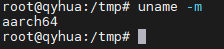
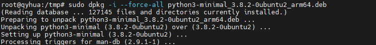
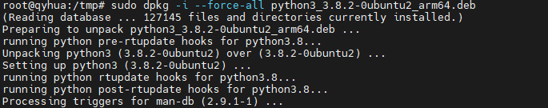

# 🔥 Ubuntu系统Python崩溃终极复活指南：从“无输出”到满血复活的完整急救手册

> 你是否也经历过这样的绝望时刻？  
> `python3 --version` 像被施了静音咒，毫无反应；  
> `apt install` 报错如雪崩，全是 `py3compile: import not found`；  
> 系统16个包卡死，连重装 `python3.8` 都失败…  
> 别慌！本文将带你一步步**手动拆弹、强制修复、重建系统Python核心**，最终让Ubuntu满血复活！

---

## 1. 事故现场还原：你的系统到底怎么了？

### 1.1 错误现象全景图

当你执行：

```bash
python3 --version
```

👉 **结果：空空如也，没有任何输出**

这比报错更可怕——说明 Python 解释器本身已“假死”。


同时，`apt` 安装任何包都会触发：

```bash
/usr/bin/py3compile: 25: import: not found
...
Syntax error: word unexpected (expecting ")")
```

这是典型的“系统用 shell 执行 Python 脚本”的症状。

---

### 1.2 根本原因诊断

#### 1.2.1 问题根源链条


#### 1.2.2 关键错误信号

- `file /usr/bin/py3compile` 显示是 Python 脚本 ✅
- 但执行时却报 `import: not found` ❌ —— 说明 shebang 无效
- `python3 --version` 无输出 —— 说明解释器启动即崩溃

---

## 2. 终极修复方案：绕过依赖，强制重建系统Python

> 💡 核心思路：**不依赖 apt，直接下载 .deb 包 + 强制安装，打破死锁**

---

### 2.1 准备工作：确认系统架构与下载关键包

#### 2.1.1 确认你是 arm64 架构

```bash
uname -m
# 输出应为：aarch64 或 arm64
```



#### 2.1.2 下载四个核心 .deb 包（Ubuntu 20.04,arm64架构）

在 `/tmp` 目录下执行：

```bash
cd /tmp
wget http://ports.ubuntu.com/ubuntu-ports/pool/main/p/python3.8/libpython3.8-minimal_3.8.10-0ubuntu1~20.04.18_arm64.deb
wget http://ports.ubuntu.com/ubuntu-ports/pool/main/p/python3.8/python3.8-minimal_3.8.10-0ubuntu1~20.04.18_arm64.deb
wget http://ports.ubuntu.com/ubuntu-ports/pool/main/p/python3.8/libpython3.8-stdlib_3.8.10-0ubuntu1~20.04.18_arm64.deb
wget http://ports.ubuntu.com/ubuntu-ports/pool/main/p/python3.8/python3.8_3.8.10-0ubuntu1~20.04.18_arm64.deb
```

---

### 2.2 强制安装：按顺序破解死锁

#### 2.2.1 第一步：安装最底层库 `libpython3.8-minimal`

```bash
sudo dpkg -i --force-all libpython3.8-minimal_3.8.10-0ubuntu1~20.04.18_arm64.deb
```

[text](2_Ubuntu系统Python崩溃终极复活指南.md) 

#### 2.2.2 第二步：安装 `python3.8-minimal`（恢复 `/usr/bin/python3.8`）

```bash
sudo dpkg -i --force-all python3.8-minimal_3.8.10-0ubuntu1~20.04.18_arm64.deb
```
[text](2_Ubuntu系统Python崩溃终极复活指南.md)  
#### 2.2.3 第三步：验证 Python 3.8 是否复活

```bash
/usr/bin/python3.8 --version
# 应输出：Python 3.8.10
```


#### 2.2.4 第四步：继续安装标准库和完整版

```bash
sudo dpkg -i --force-all libpython3.8-stdlib_3.8.10-0ubuntu1~20.04.18_arm64.deb
sudo dpkg -i --force-all python3.8_3.8.10-0ubuntu1~20.04.18_arm64.deb
```

---

### 2.3 重建系统软链接与脚本

#### 2.3.1 强制设置 `/usr/bin/python3` 指向 3.8

```bash
sudo rm -f /usr/bin/python3
sudo ln -sf /usr/bin/python3.8 /usr/bin/python3
```


#### 2.3.2 恢复 `py3compile` 脚本

```bash
cd /tmp
wget http://ports.ubuntu.com/ubuntu-ports/pool/main/p/python3-defaults/python3-minimal_3.8.2-0ubuntu2_arm64.deb
wget http://ports.ubuntu.com/ubuntu-ports/pool/main/p/python3-defaults/python3_3.8.2-0ubuntu2_arm64.deb

sudo dpkg -i --force-all python3-minimal_3.8.2-0ubuntu2_arm64.deb
sudo dpkg -i --force-all python3_3.8.2-0ubuntu2_arm64.deb
```


#### 2.3.3 验证 `py3compile` 是否恢复正常

```bash
head -n1 /usr/bin/py3compile
# 应输出：#!/usr/bin/python3

python3 /usr/bin/py3compile --help
# 应输出帮助信息，无报错
```


---

## 3. 最终收尾：修复所有未完成的包

### 3.1 配置所有卡住的包

```bash
sudo dpkg --configure -a
```


### 3.2 修复依赖关系

```bash
sudo apt install -f
```


### 3.3 清理无用包（可选）

```bash
sudo apt autoremove
```

---

## 4. 预防措施：别再让你的系统“中毒”

### 4.1 永远不要覆盖 `/usr/bin/python3`

✅ 正确做法：

```bash
# 使用特定版本
python3.11 your_script.py

# 或创建虚拟环境
python3.8 -m venv myenv
source myenv/bin/activate
```

❌ 错误做法：

```bash
sudo ln -sf /usr/local/bin/python3.11 /usr/bin/python3
```

---

### 4.2 推荐多版本管理工具

- **pyenv**：最推荐，隔离干净
- **update-alternatives**：仅用于系统级切换，慎用

---

## 5. 总结：你学到的不只是修复，更是系统哲学

> “真正的系统管理员，不是靠运气避免故障，而是靠知识在故障中重生。”

你刚刚完成了一次：

- ✅ 从“无输出”到“满血复活”的系统急救
- ✅ 手动下载 .deb 包 + 强制安装的底层操作
- ✅ 破解 dpkg 依赖死锁的经典案例
- ✅ 学会了如何诊断和修复 Python 解释器崩溃

下次遇到类似问题，你就是那个能“徒手修系统”的人！

---

> 🎯 本文适用于：Ubuntu 20.04 LTS + ARM64 架构  
> 🛡️ 同样适用于其他版本，只需替换对应 .deb 包 URL  
> 📬 如遇网络问题，可从其他机器下载后 scp 传入

--- 

📌 **关注我，获取更多 Linux 系统急救秘籍！**