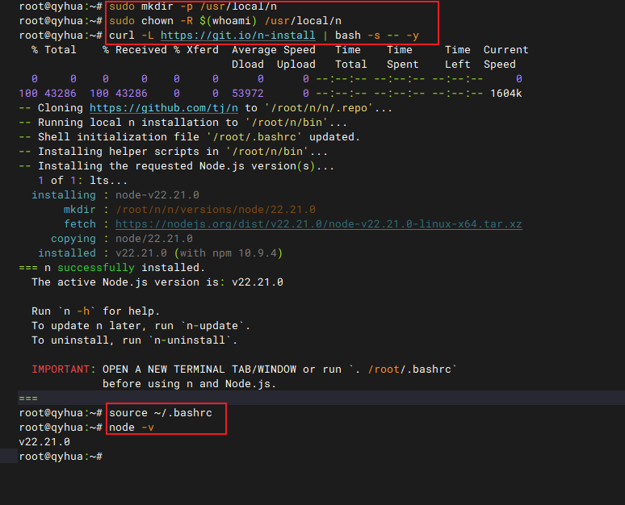
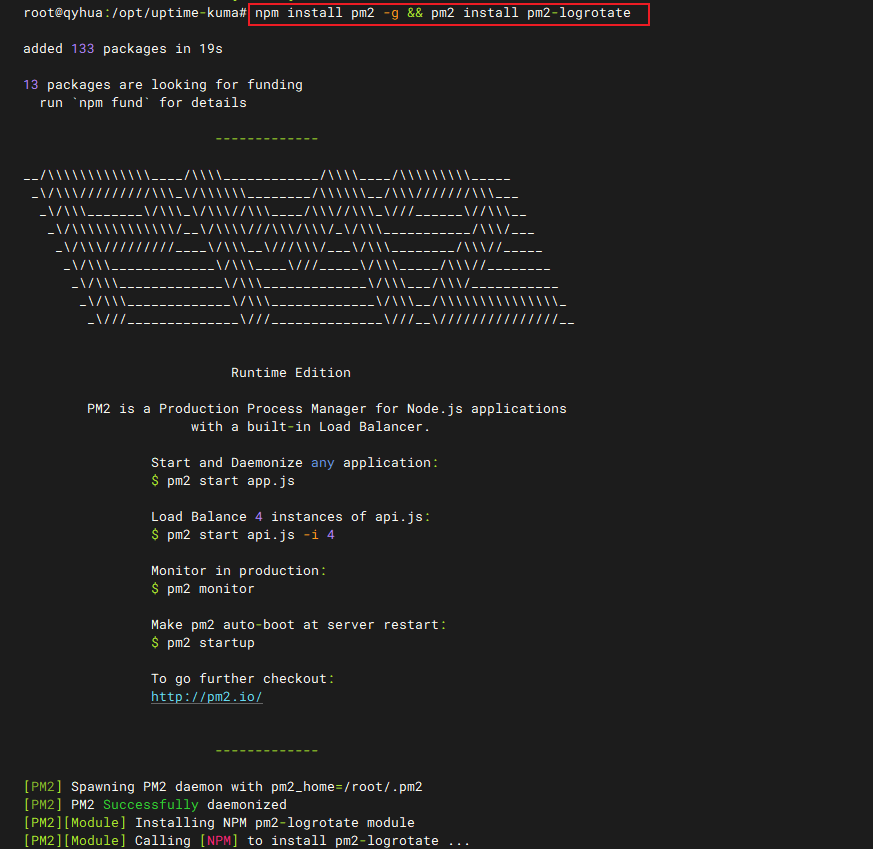
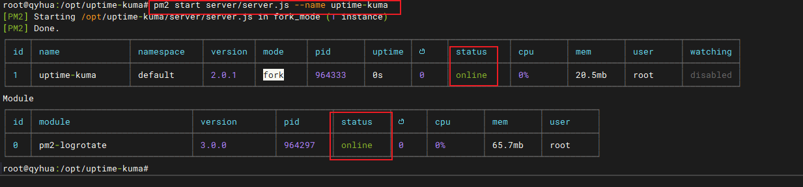
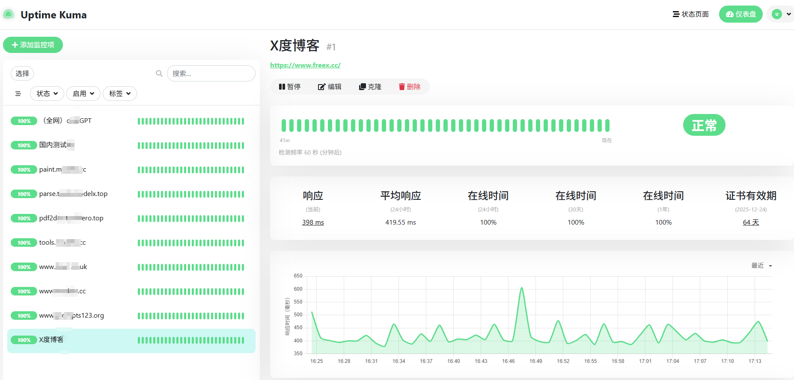

# 从零部署自维护版 Uptime Kuma：Node.js + PM2 + Nginx 全链路实战指南


## 1. 引言：为什么选择“非 Docker”部署？

Uptime Kuma 是一款开源、美观、功能强大的站点监控工具，广受开发者喜爱。官方推荐使用 Docker 部署，简单快捷。但如果你：

- 对源码进行了深度定制（如新增通知渠道、修改 UI）
- 需要精细控制运行环境
- 所在环境禁止使用容器技术

那么，**纯 Node.js + PM2 + Nginx 的部署方式**就是你的最佳选择。本文将手把手带你完成从环境搭建到上线运行的全过程，并重点解决 **Node.js 版本混乱、Nginx 反向代理、数据安全** 三大痛点。

---

## 2. 环境准备：Ubuntu 20.04 系统初始化

### 2.1 创建专用运行用户（安全第一）

为避免以 `root` 身份运行应用，我们创建一个无登录权限的系统用户：

```bash
sudo useradd -r -s /bin/false kuma
```

> ✅ 该用户仅用于运行服务，无法登录，极大提升安全性。

### 2.2 选择合理的部署目录

根据 Linux 文件系统标准（FHS），**第三方应用应部署在 `/opt` 目录下**：

```bash
sudo mkdir -p /opt/uptime-kuma
sudo chown -R kuma:kuma /opt/uptime-kuma
```

> 📁 最终结构：
> ```
> /opt/uptime-kuma/
> ├── dist/          # 前端静态资源
> ├── server/        # 后端 Node.js 代码
> └── package.json
> ```

---

## 3. Node.js 环境搭建：告别 v10，拥抱 v18+

许多用户在 Ubuntu 20.04 上执行官方安装脚本后，仍发现 `node -v` 显示 **v10.x**。这是因为系统仓库默认包含旧版 Node.js，且路径优先级混乱。

### 3.1 为什么 Nodesource 脚本可能失效？

- 网络问题导致脚本下载失败（返回 HTML 而非 shell 脚本）
- 旧版 Node.js 已通过 `apt` 安装，新版本未覆盖 PATH
- 国内访问 Nodesource 官方源缓慢或被拦截

### 3.2 推荐方案：使用 `n` —— 轻量级 Node.js 版本管理器

`n` 不依赖 npm，安装简单，可无缝切换版本，**特别适合生产环境**。

#### 3.2.1 卸载旧版 Node.js（如有）

```bash
sudo apt remove --purge nodejs npm
sudo apt autoremove
```

#### 3.2.2 安装 `n` 最新版的 Node.js v22.21.0

```bash
# 安装 n（自动配置 PATH）
curl -L https://git.io/n-install | bash -s -- -y

# 重新加载 shell 配置
source ~/.bashrc

# 验证
node -v  # 应输出 v18.x.x
npm -v
```

> ✅ 输出示例：
> ```
> $ node -v
> v22.21.0
> ```





---

## 4. 项目部署：前后端分离部署策略

### 4.1 上传代码到服务器

将本地调试完成的 `uptime-kuma-master` 目录上传至 `/opt/uptime-kuma`：

```bash
# 本地执行（假设服务器 IP 为 1.2.3.4）
scp -r ./uptime-kuma-master/* kuma@1.2.3.4:/opt/uptime-kuma/
```

> 📦 **只需上传以下内容**：
> - `server/`（后端核心）
> - `package.json` 和 `package-lock.json`
> - `dist/`（前端构建产物，若未构建则需在服务器执行 `npm run build`）

### 4.2 安装生产依赖

切换到项目目录，安装**仅生产依赖**：

```bash
cd /opt/uptime-kuma
npm ci --production
```

> ⚡ `--production` 参数跳过 `devDependencies`（如 webpack、babel），节省 70%+ 磁盘空间。

---

## 5. 后端服务守护：PM2 进程管理

### 5.1 安装 PM2

```bash
npm install -g pm2
```

### 5.2 以专用用户启动服务

```bash
# 切换到 kuma 用户并启动
sudo -u kuma -H pm2 start /opt/uptime-kuma/server/server.js --name uptime-kuma

# 或者以前用户直接启动
pm2 start /opt/uptime-kuma/server/server.js --name uptime-kuma
```



> 🔄 **常用命令**：
> - `pm2 logs uptime-kuma`：查看实时日志
> - `pm2 restart uptime-kuma`：重启服务
> - `pm2 list`：查看运行状态

---

## 6. Nginx 反向代理：前端 + 后端一体化访问

Uptime Kuma 前端是 SPA（单页应用），后端提供 API 和 WebSocket。我们需要 Nginx 同时处理静态文件和动态代理。

### 6.1 创建 Nginx 配置文件

```bash
sudo nano /etc/nginx/sites-available/uptime-kuma
```

粘贴以下内容：

```nginx
server {
    listen 80;
    server_name _;  # 匹配任意 IP 或域名

    # 前端静态资源目录
    root /opt/uptime-kuma/dist;
    index index.html;

    # SPA 路由支持
    location / {
        try_files $uri $uri/ @proxy;
    }

    # 代理动态请求到后端
    location @proxy {
        proxy_pass http://127.0.0.1:3001;
        proxy_http_version 1.1;
        proxy_set_header Upgrade $http_upgrade;
        proxy_set_header Connection "upgrade";
        proxy_set_header Host $host;
        proxy_set_header X-Real-IP $remote_addr;
        proxy_set_header X-Forwarded-For $proxy_add_x_forwarded_for;
        proxy_set_header X-Forwarded-Proto $scheme;
        proxy_cache_bypass $http_upgrade;
        proxy_read_timeout 86400;  # 支持长连接
    }

    # 安全：禁止访问隐藏文件
    location ~ /\. {
        deny all;
    }
}
```

### 6.2 启用配置并重载 Nginx

```bash
sudo nginx -t && sudo systemctl reload nginx
```

> ✅ 现在访问 `http://你的服务器IP` 即可看到 Uptime Kuma 界面！

[主界面效果](<8_从零部署自维护版 Uptime Kuma.md>) 
---


## 7. 结语：安全、稳定、可维护

通过本文，你已成功在 Ubuntu 20.04 上部署了自维护版 Uptime Kuma：

- ✅ 使用 `n` 安装纯净 Node.js 18 环境
- ✅ 采用 `/opt` 规范化部署目录
- ✅ 通过 PM2 实现进程守护与开机自启
- ✅ 配置 Nginx 完美支持 SPA + WebSocket

> 🔜 **下一步建议**：
> - 使用 Certbot 为站点启用 HTTPS
> - 配置 Fail2ban 防止暴力破解


--- 

> 📝 **作者**：qyhua | 专注高可用系统架构  
> 📅 **最后更新**：2025 年 10 月 21 日  
> 🔗 **GitHub**：[uptime-kuma](https://github.com/louislam/uptime-kuma) 